## 🥰 **출처**

- “Computer Graphics(2023 Spring)’ 서울여자대학교 김현진 교수님(hyunjinkim@swu.ac.kr)
- [https://m.blog.naver.com/PostView.naver?isHttpsRedirect=true&blogId=studycadcam&logNo=220622207133](https://m.blog.naver.com/PostView.naver?isHttpsRedirect=true&blogId=studycadcam&logNo=220622207133)
- [https://l3dp.tistory.com/12](https://l3dp.tistory.com/12)

---

## 🤔 컴퓨터 그래픽스란 무엇일까?

`컴퓨터그래픽스` 란 “컴퓨터를 사용하여 그림을 **생성**하는 기술”이다.

지금부터 `컴퓨터그래픽스`를 이용한 응용 기술들을 설명할 것이다.

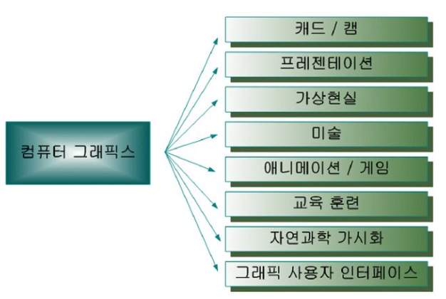

## 😙 컴퓨터 그래픽스 응용 기술

### 💙 CAD (Computer Aided Design)

`CAD` 란 ‘컴퓨터 지원 **설계**’를 의미한다.

일반적인 설계와 달리 컴퓨터를 이용한 설계는 다음과 같은 특징이 있다.

- 컴퓨터를 이용하기 때문에 인력, 시간, 노력 등을 단축 가능하다.
- 설계 효율을 향상 시킬 수 있다.

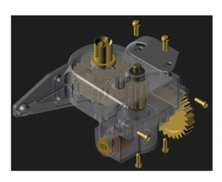

### 💙 CAM (Computer Aided Manufacturing)

`CAM` 이란 ‘컴퓨터 지원 **공정(가공/생산)**’을 의미한다.

일반적인 공정과 달리 컴퓨터를 이용한 공정은 다음과 같은 특징이 있다.

- 수치 제어(Numerical Control Machine) 형식을 따라 일관된 수치로 공정을 진행할 수 있다.
- 자동생산을 진행하기 때문에 효율과 가공의 정밀도가 향상 된다.

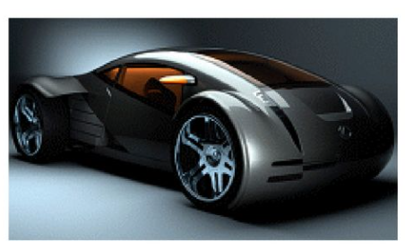

### 💙 프레젠테이션 그래픽스(Presentation Graphics)

프레젠테이션 자료(ppt)를 만들 때 사용되는 그래픽 기술이다.

- 막대 차트(Bar Chart), 선 그래프(Line Chart), 파이 차트(Pie Chart), 입체 그래프(Surface Graph) 등이 존재한다.
- 프레젠테이션 자료는 시각적인 전달력이 뛰어나야 하기 때문에 전달 대상의 시선을 붙잡는 것이 중요하다.
- ‘백문이 불여일견’과 걸맞도록 그래픽이 정보들을 함축하여 효율적으로 전달되어야 한다.

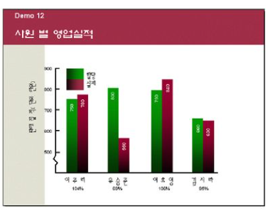

### 💙 가상 현실(Virtual Reality)

`가상 현실` 이란 “**존재하지 않는 가상의 환경**을 마치 현실과 똑같이 느껴지도록 구현하는 기술”이다.

⭐ `가상 현실` 의 기술적 요소

- 입체 화면 : 현실과 비슷하게 시각적 요소들이 입체로 보여져야 한다.
- 3차원 입체 음향 : 거리감에 따라 청각적 요소들이 3차원으로 다가와야 한다.
- 데이터 장갑 : 가상 현실 속 물체들이 거리감에 따라 상호작용 되어야한다.
- 장면 데이터베이스 : 각각의 장면들이 DB화 되어 장면 속 물체들의 거리와 위치가 기록되어야 한다.
- 그래픽 소프트웨어 : 포토샵, 일러스트레이터와 같은 이미지 편집 프로그래밍이다. 공간에 따라 2D/3D로, 좌표 설정 방식에 따라 벡터방식/레스터(픽셀)방식으로 나뉜다.

⭐ `가상 현실` 의 학문적 요소

- 인지과학, 전자공학, 기계공학, 음향학 등이 포함된다.

### 💙 **미술 분야에서의 컴퓨터 그래픽스**

- 무선 스타일러스 펜

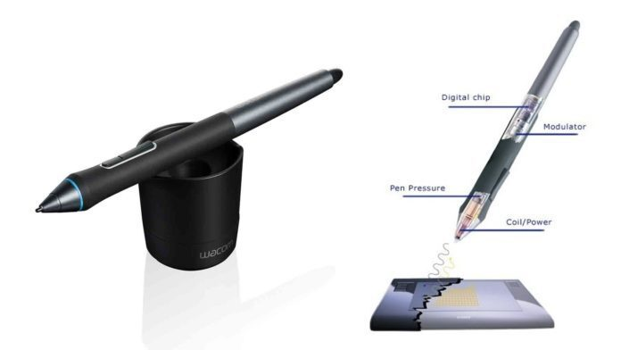

- 그래픽 소프트웨어 : 포토샵, 일러스트레이터와 같은 이미지 편집 프로그래밍이다. 공간에 따라 2D/3D로, 좌표 설정 방식에 따라 벡터방식/레스터(픽셀)방식으로 나뉜다.

### 💙 애니메이션 및 게임

`컴퓨터 그래픽스` 하면 가장 먼저 떠오르는 분야는 애니메이션 및 게임 분야일 것이다. 많은 애니메이션 영화, CG 그래픽, 게임들이 컴퓨터 그래픽스 분야에서 활발하게 발전하고 있다.

⭐ **게임 분야에서의 컴퓨터 그래픽스**

- 컴퓨터 그래픽은 `캐릭터`, `배경화면`, `애니메이션` 에 각각 이용된다.
- 컴퓨터 그래픽은 `사용자과 프로그램 사이의 상호작용` 설계에 이용된다.
- 상호작용에 걸리는 시간을 최소화 하는 것이 중요하다.
- 시장성 면에서 볼 때 무한한 가능성을 가지고 있다.

### 💙 CAI(Computer Aided Instruction)

`CAI` 는 학습 보조도구로서 컴퓨터를 활용하는 기술이다. ‘컴퓨터 이용 교육’이라고도 이야기 한다.

`CAI` 는 다음과 같은 특징이 있다.

- 컴퓨터에 내재하는 추론 기능과 지식 데이터베이스를 적극 활용한다.
- 텍스트 + 시각 정보를 동시에 활용하여 이해를 돕는다.

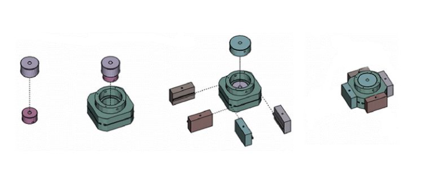

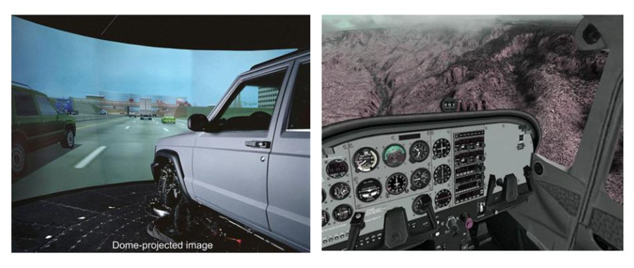

### 💙 SCI VIS(Scientific Visualiztion)

`SCI VIS` 는 대용량의 정보를 분석하는 기술이다.

주로 대용량의 정보가 주어지는 자연현상을 시각화 하고, 현상 내부의 패턴이나 추세를 직관적으로 파악하는 데 사용한다.

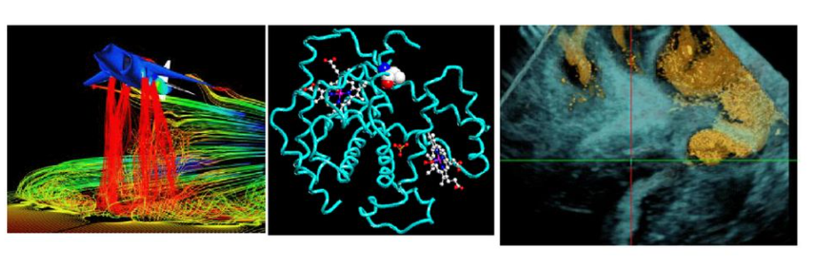

순서대로 `기류 분석`, `분자 구조`, `초음파 영상`의 사진이다.

### 💙 그래픽 사용자 인터페이스(Graphic User Interface)

흔히 `GUI` 라고 불리는 그래픽 사용자 인터페이스 기술은 사용자의 편의를 고려하여 인터페이스를 설계하는 기술을 말한다.

주로 메뉴, 스크롤바, 아이콘 등을 설계한다.

---

## 🙄 컴퓨터 그래픽스 기술의 변천

### ❤️ 1950~1960년대 - [컴퓨터 그래픽스의 창시]

⭐ **William Fetter**

- `컴퓨터 그래픽` 이란 용어를 최초로 사용

⭐ **Ivan Sutherland(이반 서더랜드)**

- 컴퓨터 그래픽의 `창시자`
- 컴퓨터 그래픽의 제반 개념을 확립
- `대화형 컴퓨터 그래픽` 개념 : 라이트 펜을 사용하여 의사전달을 진행
- 스케치패드 프로젝트 진행 : 지금의 CAD의 시초, 컴퓨터가 스케치북 역할을 할 수 있도록 함
- 직선, 원호 등 기본적 그래픽 요소를 사용하여 물체를 표현함
- 기본 물체를 조합 → 큰 물체를 모델링 : `계층구조 모델링`
- 물체를 선택하여 이동하는 방법을 사용함
- 팝업 메뉴를 통해 사용자 입력을 받음

⭐ **Douglas Englebart**

- 최초의 마우스 프로토타입

⭐ **Jack Bresenham**

- 선분 그리기 알고리즘을 개발

### ❤️ 1970년대 - [그래픽 알고리즘의 시대]

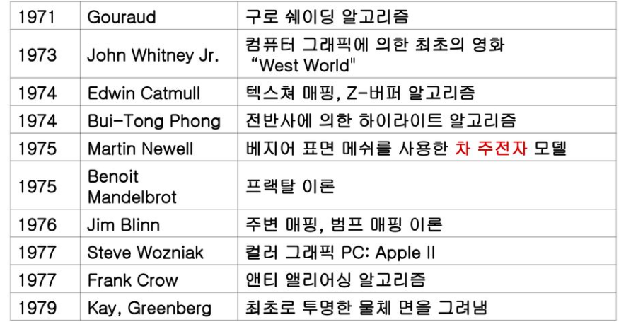

### ❤️ 1980년대 - [PC의 시대]

- 레스터 그래픽 장비 보급이 시작되었다.
- 기하 엔진이 출현하였다.

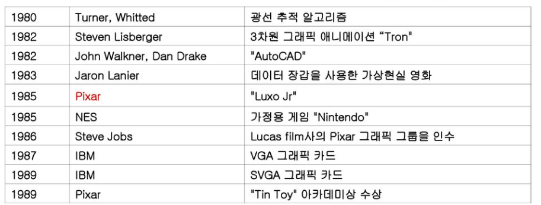

### ❤️ 1990년대 - [사실적(Photo-realistic) 그래픽 영상의 시대]

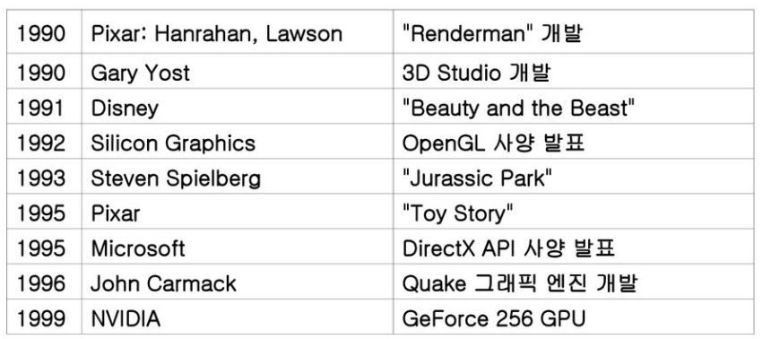

### ❤️ 2000년대 - [영화, 게임 응용의 시대]

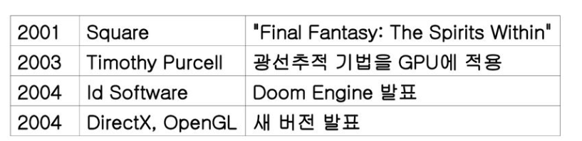

## 🤭 컴퓨터 그래픽스 구성 요소

### 💛 컴퓨터 그래픽스의 2가지 구성요소

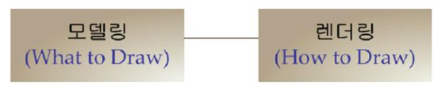

컴퓨터 그래픽스는 `모델링` 과 `렌더링` 으로 구성된다.

### 💛 모델링

모델링이란 ‘What to Draw’, 무엇을 그릴지 정하는 작업이다.

- 장면 내부 물체를 정의 하는 작업이다.
- 물체의 형태를 제작하는 과정이다.
- 색감, 질감등의 표현을 하지 않는다.
- 선분의 끝점, 다각형의 정점을 정의한다.

### 💛 렌더링

렌더링이란 ‘How to Draw’, 어떻게 그릴지 정하는 작업이다.

- 정의된 물체를 그려내는 작업이다.
- 모델링 자료에 색감, 질감, 광원 등 다양한 효과를 입힌다.

### 💛 3D 모델링 / 렌더링의 종류

⭐ **와이어 프레임 모델링(Wire Frame Modeling)**

- 점, 선, 원, 호 등의 기본적인 요소로 물체를 표현하는 3D 도면이다.
- 마치 철사를 연결한 구조물처럼 생겼다.
- 소요 시간이 적게 든다.
- 메모리의 용량이 적어도 모델링이 가능하다.
- 2차원 도면 출력을 위한 용도와 평면 가공에 적합하다.

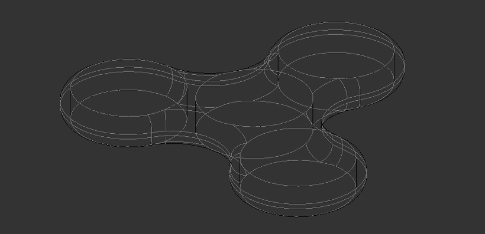

⭐ **서페이스 모델링(Suface-based Modeling)**

- 곡면 모델링이다.
- 면을 중심으로 물체를 표현한다.
- 주로 곡선과 곡면을 통해 물체의 외형만을 표현한다.
- 표면만 존재하는 모델링 기법이다.
- 컴퓨터의 속도와 메모리를 적게 사용한다.
- 실제 물체의 체적이나 용적을 구할 수 없다.

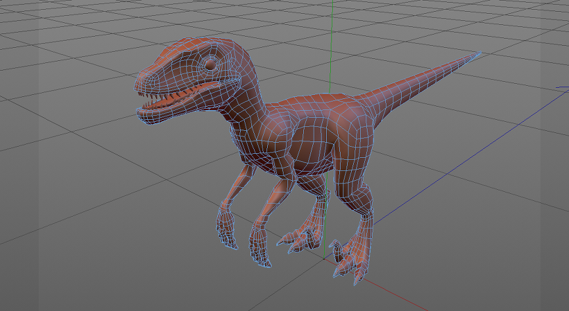

⭐ **솔리드 모델링(Solid Modeling)**

- 2D의 평면 스케치를 통해 두께, 높이가 있는 솔리드(고체)를 생성하는 모델링 기법이다.
- 3차원의 실제 물체와 같이 내부와 외부를 공학적으로 구별할 수 있다.
- 가공 전 상태를 예측하거나, 부피, 무게 등의 다양한 정보를 제공할 수 있다.

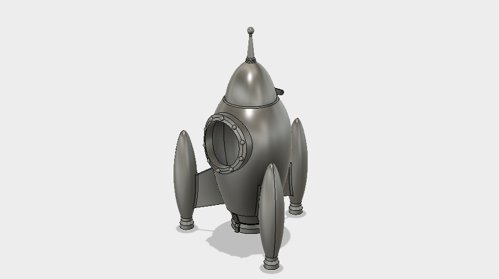