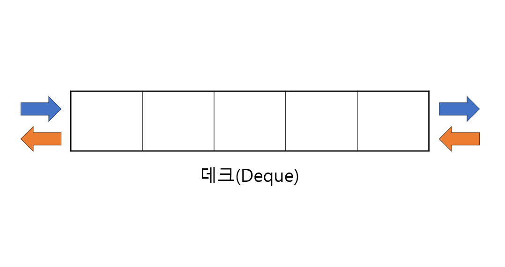
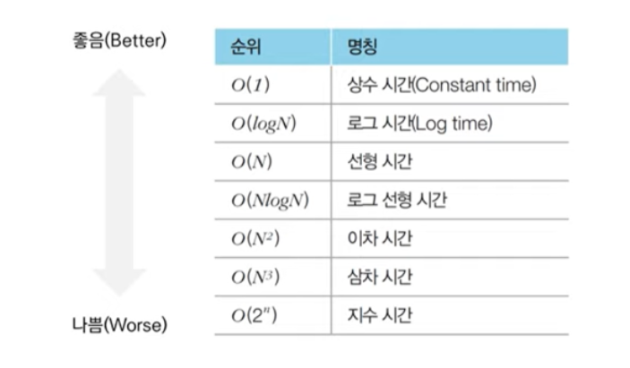
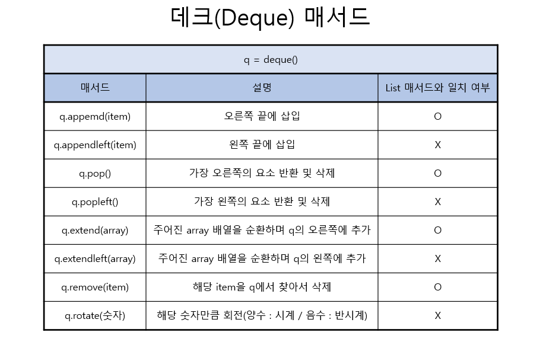

## 🥰 출처

- 박상길, 파이썬 알고리즘 인터뷰, 책만
- [https://idplab-konkuk.tistory.com/13](https://codingpractices.tistory.com/entry/Python%ED%8C%8C%EC%9D%B4%EC%8D%AC-%EC%99%9C-%EB%A6%AC%EC%8A%A4%ED%8A%B8%EB%8C%80%EC%8B%A0-%ED%81%90-%EB%8D%B0%ED%81%AC-deque-%EB%A5%BC-%EC%93%B8%EA%B9%8C)

---

## 🫡데크(Deque)란?



데크는 더블 엔디드 큐(Double-Ended Queue)의 줄임말로, 글자 그대로 양쪽 끝을 모두 추출할 수 있는, 큐를 일반화한 형태의 추상 자료형이다.

- 리스트와 같은 배열의 형태
- 양방향의 queue 형태
- 양 쪽 방향(앞, 뒤) 모두에서 요소를 추가하고 제거 가능
- 파이썬에서는 collections 모듈에서 deque라는 이름으로 데크를 지원(이중연결리스트 형태)

```python
##데크 불러오기
import collections
d = collections.deque()
```

## 😮데크(Deque)를 왜 사용하나요?



데크의 속도는 O(1)의 속도, 리스트의 속도는 O(n)의 속도로 데크의 속도가 훨씬 빠르다.

- 속도 측면에서 데크가 훨씬 빠름
- 데크는 스택(Stack) / 큐(Queue) 형태로 사용 가능
- 데크는 max length를 지정 가능

## 🤗데크(Deque)의 매서드



## 🤗데크(Deque)의 Max length

데크는 처음 선언할 때 `최대 길이 값`(Max length)을 설정할 수 있다. 리스트는 길이를 생각하여 pop/remove를 해주어야 하는데 데크는 `Max length`기능으로 편하게 사용 가능하다.

```python
from collections import deque

def solution(n, a):
	## 데크의 최대 길이 값 설
	q = deque(maxlen = n)
```

```toc

```