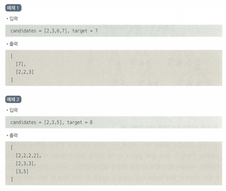
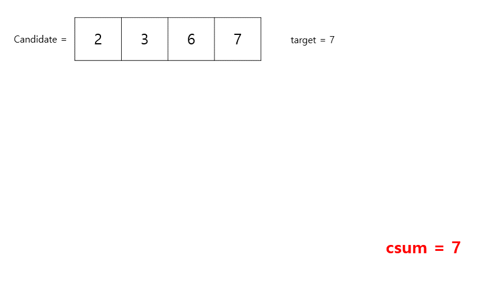

## 😍 **출처**

- 파이썬 알고리즘 인터뷰
  
---

## 😧 **문제**

숫자 집합 candidates를 조합하여 합이 target이 되는 원소를 나열하라. 각 원소는 중복으로 나열 가능하다.

## 🤔 **예제**



## 😉 **풀이) DFS로 중복 조합 그래프 탐색**

각 원소는 중복 해서 사용가능하므로 주어진 원소의 중복 조합을 모두 구해주는 것이 핵심이다.

### 💛 **예시를 통한 풀이**

- `candidate` = [2, 3, 6, 7]
- `target` = 7
- `path` = (중복조합을 구하는 리스트)
- `csum` = (target) - (하나의 조합 안의 원소들의 총 합)

이해를 쉽게 하기 위해 GIF를 먼저 보도록 하자!



재귀 호출을 반복하며 중복조합을 모두 구해나가는 것이 특징이다. 이때, 재귀 호출을 탈출하는 조건은 다음과 같다.

---

1. csum < 0 인 경우
    
    이는 target 값을 초과하였기 때문에 종료한다.
    
2. csum = 0 인 경우
    
    이는 target 값을 만족하였기 때문에 해당 중복조합을 `result`에 추가한 뒤, 종료한다.
    

```python
if csum < 0:
	return
if csum == 0:
	result.append(path)
return
```

---

### 💛 **전체 코드**

```python
class Solution:
    def combinationSum(self, candidates, target) :
        result = []

        def dfs(csum, index, path):
            # 종료 조건
            if csum < 0:
                return
            if csum == 0:
                result.append(path)
                return

            # 자신 부터 하위 원소 까지의 나열 재귀 호출
            for i in range(index, len(candidates)):
                dfs(csum - candidates[i], i, path + [candidates[i]])

        dfs(target, 0, [])
        return result
```

```toc

```