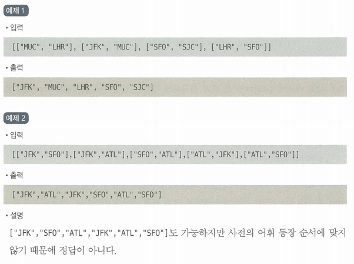
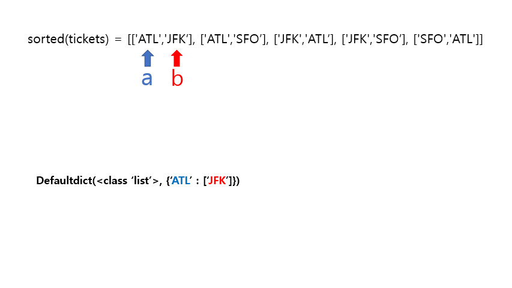
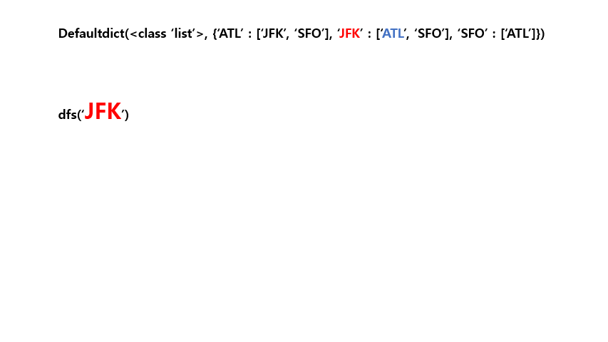
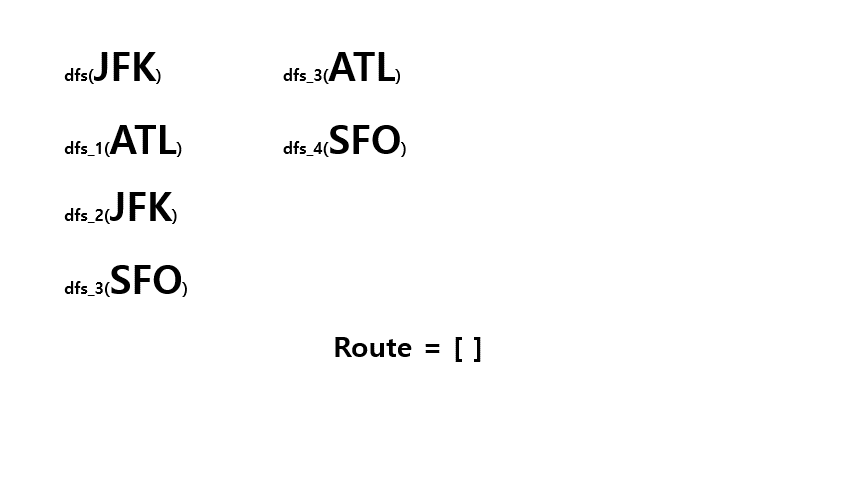

## 😍 **출처**

- 파이썬 알고리즘 인터뷰

---

## 😧 **문제**

[from, to]로 구성된 항공권 목록을 이용해 JFK에서 출발하는 여행 일정을 구성하라. 여러 일정이 있는 경우 사전 어휘 순으로 방문한다.

## 🤔 **예제**



## 😉 **풀이1) DFS로 일정 그래프 구성**

### 💛 **예시를 통한 풀이**

- `tickets` = [["JFK","SFO"],["JFK","ATL"],["SFO","ATL"],["ATL","JFK"],["ATL","SFO"]]

먼저 주어진 tickets의 요소들을 그래프 안에 넣어버리자!

```python
graph = collections.defaultdict(list)
        # 그래프 순서대로 구성
for a, b in sorted(tickets):
	graph[a].append(b)
```

- `defaltdict` : 파이썬의 내장 모듈인 `collections` 의 `defaultdict` 는 key 값을 넣었을 때 value 값이 존재하지 않더라도, 임의로 value 값을 넣어주는 **기본값을 지정한 딕셔너리**이다.
    
    ```python
    from collections import defaultdict
    
    ## defaultdict(int)일 경우
    d_dict = defaultdict(int)
    >>> d_dict["a"]
    0
    >>> d_dict
    defaultdict(<class 'int'>, {'a': 0})
    
    ## defaultdict(list)일 경우
    d_dict = defaultdict(list)
    >>> d_dict["a"]
    []
    >>> d_dict
    defaultdict(<class 'int'>, {'a': []})
    ```
    

다시 코드로 돌아와서, `graph` 라는 이름으로 딕셔너리가 선언된 것을 볼 수 있다. 이 딕셔너리는 일반적인 딕셔너리가 아닌 `dafaltdict` 딕셔너리이다. 지금부터 `graph` 안에 `tickets` 를 차곡차곡 넣어 줄 것이다.

```python
tickets = [["JFK","SFO"],["JFK","ATL"],["SFO","ATL"]
					,["ATL","JFK"],["ATL","SFO"]]

for a, b in sorted(tickets):
	graph[a].append(b)
```

문제에서 **중복된 일정인 경우 어휘 순으로 방문** 한다고 조건을 달았으니, `tickets`를 sort 해주어 어휘 순으로 정렬해준다.

```python
sorted(tickets) = [['ATL','JFK'],['ATL','SFO'],['JFK','ATL']
									,['JFK','SFO'],['SFO','ATL']]

for a, b in sorted(tickets):
	graph[a].append(b)
```



---

그래프 구성이 끝났다! `key` 에는 티겟의 출발 지점이, `value` 에는 티켓의 도착 지점이 들어간 것을 볼 수 있다. 

이제 재귀 함수를 돌리면서 끝말잇기를 해줄 것이다. 첫 출발 지점은 ‘JFK’이므로 재귀 함수에 ‘JFK’부터 넣도록 하자.

```python
def dfs(a):
	while graph[a]:
		dfs(graph[a].pop(0))

dfs('JFK')
```



---

그럼 마지막으로 결과를 낼 차례이다! 재귀함수를 하나씩 종료해주며 `route` 리스트에 추가해주자! 마지막에 들어간 값부터 pop(0) 되기 때문에 마지막에는 슬라이싱을 통해 전체를 뒤집어준다.

```python
route = []

def dfs(a):
	while graph[a]:
		dfs(graph[a].pop(0))
	route.append(a)

dfs('JFK')
route = route[::-1]
```



---

### 💛 **전체 코드**

```python
import collections
from typing import List

class Solution:
    def findItinerary(self, tickets: List[List[str]]) -> List[str]:
        graph = collections.defaultdict(list)
        # 그래프 순서대로 구성
        for a, b in sorted(tickets):
            graph[a].append(b)

        route = []

        def dfs(a):
            # 첫 번째 값을 읽어 어휘순 방문
            while graph[a]:
                dfs(graph[a].pop(0))
            route.append(a)

        dfs('JFK')
        # 다시 뒤집어 어휘순 결과로
        return route[::-1]
```

---

## 😜 **풀이2) 스택 연산으로 큐 연산 최적화 시도**

위에서는 `pop(0)` 을 사용하였는데, 이는 O(1)인 `pop()` 과는 다르게 O(n)이다. 따라서 좀 더 효율적인 구현을 위해 `pop()` 을 사용해주도록 하자! 그럼 애초에 그래프를 역순으로 구성하면 깔끔하다!

```python
graph = collections.defaultdict(list)
        # 그래프 뒤집어서 구성
        for a, b in sorted(tickets, reverse=True):
            graph[a].append(b)
```

**reverse=True** 하나로 Big-O를 줄일 수 있다니...😮

### 💛 **전체 코드**

```python
import collections
from typing import List

class Solution:
    def findItinerary(self, tickets: List[List[str]]) -> List[str]:
        graph = collections.defaultdict(list)
        # 그래프 뒤집어서 구성
        for a, b in sorted(tickets, reverse=True):
            graph[a].append(b)

        route = []

        def dfs(a):
            # 마지막 값을 읽어 어휘순 방문
            while graph[a]:
                dfs(graph[a].pop())
            route.append(a)

        dfs('JFK')
        # 다시 뒤집어 어휘순 결과로
        return route[::-1]
```

```toc

```