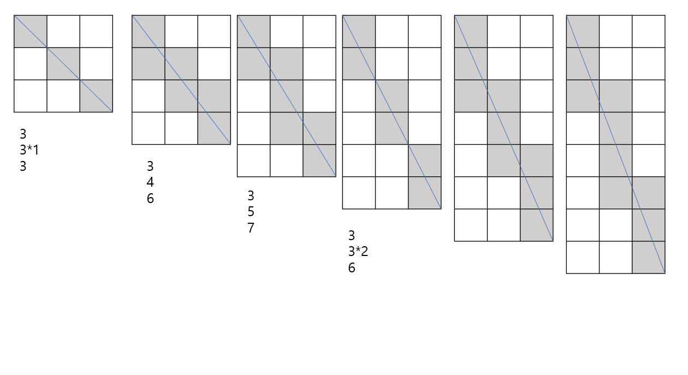
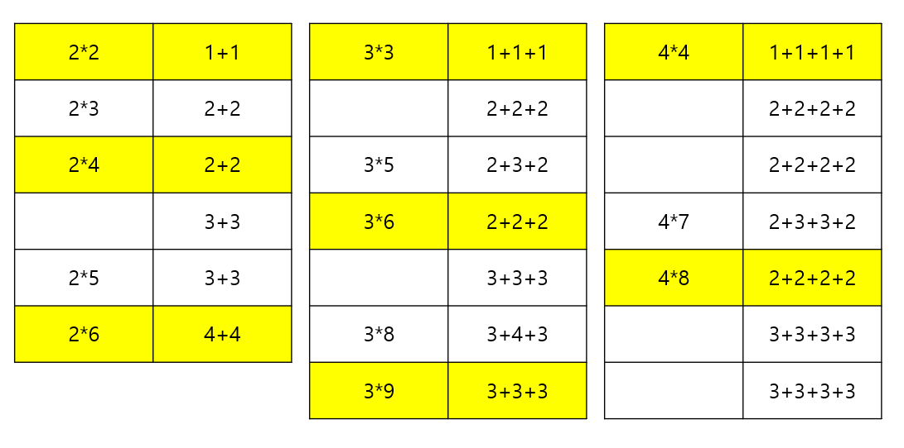
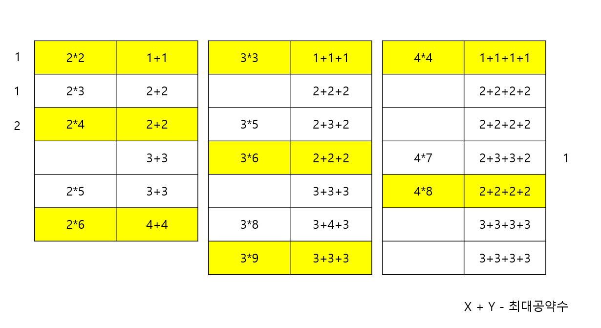

## 🤔 문제 설명

가로 길이가 Wcm, 세로 길이가 Hcm인 직사각형 종이가 있습니다. 

종이에는 가로, 세로 방향과 평행하게 격자 형태로 선이 그어져 있으며, 모든 격자칸은 1cm x 1cm 크기입니다. 

이 종이를 격자 선을 따라 1cm × 1cm의 정사각형으로 잘라 사용할 예정이었는데, 누군가가 이 종이를 대각선 꼭지점 2개를 잇는 방향으로 잘라 놓았습니다. 

그러므로 현재 직사각형 종이는 크기가 같은 직각삼각형 2개로 나누어진 상태입니다. 

새로운 종이를 구할 수 없는 상태이기 때문에, 이 종이에서 원래 종이의 가로, 세로 방향과 평행하게 1cm × 1cm로 잘라 사용할 수 있는 만큼만 사용하기로 하였습니다.

가로의 길이 W와 세로의 길이 H가 주어질 때, 사용할 수 있는 정사각형의 개수를 구하는 solution 함수를 완성해 주세요.

---

## 😉 제한사항

- W, H : 1억 이하의 자연수

---

## 😧 입출력 예

| W | H | result |
| --- | --- | --- |
| 8 | 12 | 80 |

---

## 🥳 풀이

### ❤️ 생각의 흐름

1. **어디서 본 듯 한 수학 문제... 수학적으로 접근!**
    
    급수 문제 풀 듯이 일단 규칙 찾을 때까지 그려본다.
    
    
    
    그리다 보니, 회색 부분의 사각형이 세기 편하게 나오는 것을 발견했다.
    
---
    
2. **본격적인 규칙 찾기**



먼저 회색 부분의 사각형을 숫자의 덧셈으로 풀어서 나타내줬다. 이때 발견한 규칙! 


>💡 **`h` = `w` * k 일 때, 회색 사각형의 개수는 (k + k + k)이다.**


회색 사각형의 개수와 `w`, `h`와의 관계에 **배수**가 큰 역할을 하고 있다는 힌트를 찾을 수 있다.

사실, 배수가 큰 역할을 하고 있으면 대부분 **최대공약수**와 **최소공배수**를 한번씩 구해서 풀어보면 거의 풀린다... 자연스럽게 **최대공약수**를 구해보니,




>🎉 **회색 사각형의 개수 = `w` + `h` - (`w` 와 `h` 의 최대공약수)**


---

### ❤️ 전체 코드

```python
import math

def solution(w,h):
    wh_gcd = math.gcd(w,h)
    answer = w * h - (w + h - wh_gcd)
    return answer
```

```toc

```