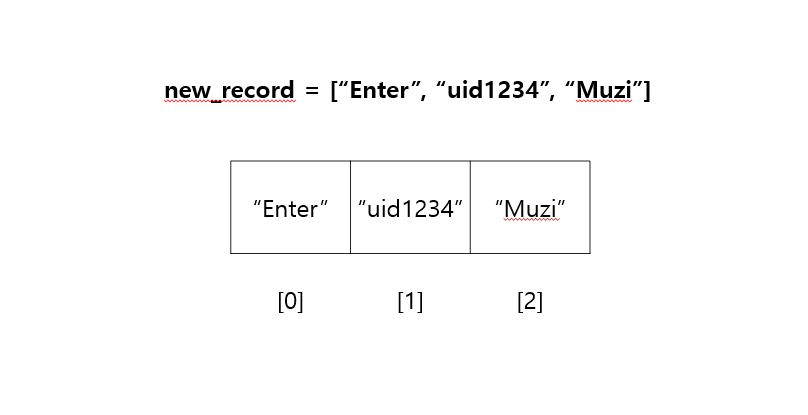

## 🤔문제 설명

카카오톡 오픈채팅방에서는 친구가 아닌 사람들과 대화를 할 수 있는데, 본래 닉네임이 아닌 가상의 닉네임을 사용하여 채팅방에 들어갈 수 있다.

신입사원인 김크루는 카카오톡 오픈 채팅방을 개설한 사람을 위해, 다양한 사람들이 들어오고, 나가는 것을 지켜볼 수 있는 관리자창을 만들기로 했다. 채팅방에 누군가 들어오면 다음 메시지가 출력된다.

"[닉네임]님이 들어왔습니다."

채팅방에서 누군가 나가면 다음 메시지가 출력된다.

"[닉네임]님이 나갔습니다."

채팅방에서 닉네임을 변경하는 방법은 다음과 같이 두 가지이다.

- 채팅방을 **나간 후**, 새로운 닉네임으로 다시 들어간다.
- **채팅방에서** 닉네임을 변경한다.

닉네임을 변경할 때는 **기존에 채팅방에 출력되어 있던 메시지의 닉네임도 전부 변경**된다.

예를 들어, 채팅방에 "Muzi"와 "Prodo"라는 닉네임을 사용하는 사람이 순서대로 들어오면 채팅방에는 다음과 같이 메시지가 출력된다.

"Muzi님이 들어왔습니다.""Prodo님이 들어왔습니다."

채팅방에 있던 사람이 나가면 채팅방에는 다음과 같이 메시지가 남는다.

"Muzi님이 들어왔습니다.""Prodo님이 들어왔습니다.""Muzi님이 나갔습니다."

Muzi가 나간후 다시 들어올 때, Prodo 라는 닉네임으로 들어올 경우 기존에 채팅방에 남아있던 Muzi도 Prodo로 다음과 같이 변경된다.

"Prodo님이 들어왔습니다.""Prodo님이 들어왔습니다.""Prodo님이 나갔습니다.""Prodo님이 들어왔습니다."

채팅방은 **중복 닉네임을 허용**하기 때문에, 현재 채팅방에는 Prodo라는 닉네임을 사용하는 사람이 두 명이 있다. 이제, 채팅방에 두 번째로 들어왔던 Prodo가 Ryan으로 닉네임을 변경하면 채팅방 메시지는 다음과 같이 변경된다.

"Prodo님이 들어왔습니다.""Ryan님이 들어왔습니다.""Prodo님이 나갔습니다.""Prodo님이 들어왔습니다."

채팅방에 들어오고 나가거나, 닉네임을 변경한 기록이 담긴 문자열 배열 record가 매개변수로 주어질 때, 모든 기록이 처리된 후, **최종적으로 방을 개설한 사람이 보게 되는 메시지**를 **문자열 배열 형태**로 return 하도록 solution 함수를 완성하라.

---

## 😎제한사항

- record는 다음과 같은 문자열이 담긴 배열이며, 길이는 `1` 이상 `100,000` 이하이다.
- 다음은 record에 담긴 문자열에 대한 설명이다.
    - 모든 유저는 [유저 아이디]로 구분한다.
    - [유저 아이디] 사용자가 [닉네임]으로 채팅방에 입장 - "Enter [유저 아이디] [닉네임]" (ex. "Enter uid1234 Muzi")
    - [유저 아이디] 사용자가 채팅방에서 퇴장 - "Leave [유저 아이디]" (ex. "Leave uid1234")
    - [유저 아이디] 사용자가 닉네임을 [닉네임]으로 변경 - "Change [유저 아이디] [닉네임]" (ex. "Change uid1234 Muzi")
    - 첫 단어는 Enter, Leave, Change 중 하나이다.
    - 각 단어는 공백으로 구분되어 있으며, 알파벳 대문자, 소문자, 숫자로만 이루어져있다.
    - 유저 아이디와 닉네임은 알파벳 대문자, 소문자를 구별한다.
    - 유저 아이디와 닉네임의 길이는 `1` 이상 `10` 이하이다.
    - 채팅방에서 나간 유저가 닉네임을 변경하는 등 잘못 된 입력은 주어지지 않는다.

---

## 😊입출력 예

| record | result |
| --- | --- |
| ["Enter uid1234 Muzi", "Enter uid4567 Prodo","Leave uid1234","Enter uid1234 Prodo","Change uid4567 Ryan"] | ["Prodo님이 들어왔습니다.", "Ryan님이 들어왔습니다.", "Prodo님이 나갔습니다.", "Prodo님이 들어왔습니다."] |

---

## 🥳풀이

### 💜**생각의 흐름**
1. **주어진 `record` 공백 기준으로 나누기**
        
    > ✔️ record = ["Enter uid1234 Muzi", "Enter uid4567 Prodo","Leave uid1234","Enter uid1234 Prodo","Change uid4567 Ryan"]   
    

    주어진 `record` 에서 우리가 필요한건 다음과 같다.
        
    - 명령어 : `Enter`, `Leave`, `Change`
    - 아이디 : `uid1234`, `uid4567`
    - 닉네임 : `Muzi`, `Prodo`, `Ryan`
        
    각각의 요소들은 ‘ ‘(공백) 기준으로 문자열에 들어있는데, 이를 사용하기 위해 먼저 다 나누어주자는 생각을 했다.
        
     `split` 함수를 통해 나누어준다.
        
    ```python
    for word in record :
            new_record = word.split(' ')
    ```
        
    
    *new_record의 형태*
        
    ---
        
1. **아이디와 닉네임을 보관하는 딕셔너리 만들기**
        
    닉네임은 아이디는 둘다 text로 이루어져 있고, 1:1로 매칭된다. 파이썬에는 이런 1:1 매칭 관계에 아주 유용히 사용할 수 있는 `딕셔너리` 가 있다.
        
    딕셔너리는 `key`에 따라 `Value`를 **dic[key] = Value** 라는 딱 한 줄로 변경 가능하기 때문에 이 문제에 찰떡이다.
        
    `1번` 과 같은 방법으로 `record`를 `new_record`에 넣을 경우 명령어는 0번 인덱스, 아이디는 1번 인덱스, 닉네임은 2번 인덱스에 들어간다. **대부분은 말이다...**
        
    “Leave uid1234”와 같이 **Leave 명령어**가 쓰일 경우에는 **닉네임이 없어서 3번 인덱스가 없다!** 깔끔하게 예외처리 해준다.
        
    나머지의 경우는 1번 인덱스에 해당하는 **아이디**를 `key`값으로 가지고, 2번 인덱스에 해당하는 **닉네임**을 `value`값으로 가지는 딕셔너리를 만들어준다.
        
    ```python
    if new_record[0] == 'Leave' :
        	continue
    else :
        	dic[new_record[1]] = new_record[2]
        	## new_record[1] = id
        	## new_record[2] = name
    ```
        
    ---
        
2. **문장 출력하기**
            
    이제 문장만 출력하면 된다! 출력의 경우 ‘Change’ 명령어는 해당되지 않으므로 ‘Enter’와 ‘Leave’에 해당하는 문장만 출력해준다.
            
    아이디와 닉네임이 매칭 되어있는 딕셔너리를 이용하여 편하게 출력해주자!
            
    ```python
    for word in record :
            new_record = word.split(' ')
            split_record.append(new_record)
            
    for out in split_record :
            if out[0] == 'Enter' :
                answer.append(dic[out[1]] + "님이 들어왔습니다.")
            if out[0] == "Leave" :
                answer.append(dic[out[1]] + "님이 나갔습니다.")
    ```
            
### 💜**전체 코드**
    
```python
def solution(record):
    answer = []
    split_record = []
    dic = {}
    
    for word in record :
        new_record = word.split(' ')
        split_record.append(new_record)
    
        if new_record[0] == 'Leave' :
            continue
        else :
            dic[new_record[1]] = new_record[2]
    
    for out in split_record :
        if out[0] == 'Enter' :
            answer.append(dic[out[1]] + "님이 들어왔습니다.")
        if out[0] == "Leave" :
            answer.append(dic[out[1]] + "님이 나갔습니다.")
    
    return answer
```

```toc

```