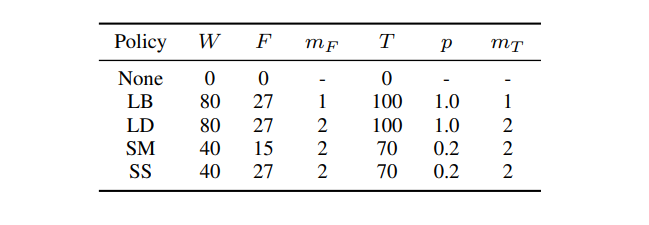

# 📌 논문 소개

* **논문 이름** : **`SpecAugument`**

* **논문 링크** : [arxiv.org/abs/1904.0877](https://arxiv.org/abs/1904.08779)

* **핵심 아이디어** : 음성 인식을 위한 **새로운 증강 기법**을 통한 성능 향상

---

# 📄 논문 리뷰

## ◼ 새롭게 제시한 증강 기법

### 1. `Time Warping`

스펙트로그램 데이터를 특정한 시간 경로로 나눈 뒤, 이를 왜곡시킴.(늘리거나 줄이는 등) 데이터에 약간의 시간적 변화를 주는 것.

### 2. `Time Masking`

입력 스펙트로그램에서 일정 시간 영역을 랜덤하게 가리는 기술. 가리는 영역의 최대 길이를 설정할 수 있고, 이를 통해 지나치게 큰 영역을 가리지 않도록 제어 가능하다.

### 3. `Frequency Masking`

입력 스펙트로그램에서 일정 주파수 영역을 랜덤하게 가리는 기술. Time Masking과 같이 가리는 영역의 최대 길이를 설정할 수 있고, 이를 통해 지나치게 큰 영역을 가리지 않도록 제어 가능하다.

---

## ◼ 새로운 증강 기법을 사용한 전처리 정책



- **W** : 시간 왜곡 매개 변수(`**Time Warping**`에 사용)
- **F** : 주파수 마스킹 매개 변수(`**Frequency Masking**`에 사용)
- **mF** : 적용된 주파수 마스킹 수(`**Frequency Masking**`에 사용)
- **T** : 시간 마스킹 매개 변수(`**Time Masking**`에 사용)
- **mt** : 적용된 시간 마스킹 횟수(`**Time Masking**`에 사용)
- **LB** : LibriSpeech basic
- **LD** : LibriSpeech double
- **SM** : Switchboard mild
- **SS** : Switchboard strong

각각의 증강 기법에 필요한 매개 변수 조정을 통해, 총 4가지의 전처리 정책을 제시하였다. LibriSpeech와 Switchboard는 데이터셋 이름이다.

---

## ◼ 새로운 증강 기법 테스트 결과(모델 성능)


위의 표는 **Word Error Rate(WER)** 이라는 음성 인식 성능 지표를 정리한 내용을 담고 있다. WER는 모델이 인식한 단어 중에서 실제 정답과 다른 단어의 비율을 나타낸다. WER 값이 낮을수록 모델의 성능이 우수하다.

논문에서 비교를 위해 사용된 모델은 다음과 같다.

- **HMM(Hidden Markov Model)** : 음성 인식에서 전통적으로 사용되는 모델 중 하나. 시퀀스 데이터를 다루는데 효과적.
- **CTC(Connectionist Temporal Classification)** : 시퀀스 레이블링 문제를 해결하기 위해 제안된 딥러닝 기반 모델. 음성 인식에서 많이 사용 됨.
- **LAS(Listen, Attend, and Spell)** : 딥러닝 기반의 음성 인식 모델. attention 메커니즘을 사용하여 시퀀스를 처리.
- **Our Work** : 논문에서 제시된 전처리 방법을 이용한 모델.

각각의 모델들에 사용 된 데이터 셋은 다음과 같다.

- **No LM / With LM** : Language Modeling의 유무. 언어 모델을 사용했는지, 사용하지 않았는지를 나타낸다.
- **SWBD(Switchboard Copus)** : 대화형 음성 통화 데이터셋으로, 음성 인식 및 자연어 처리 연구에 널리 사용됨.
- **CH(CallHome Copus)** : 전화 통화 데이터셋으로, 음성 인식 및 자연어 처리 연구에 널리 사용됨.

결과를 보면, 논문에서 제시된 새로운 전처리 방법을 이용한 모델의 성능이 좋은 것(숫자가 비교적 작음)을 볼 수 있다.

---

## ◼ 새로운 증강 기법 테스트 결과(증강 기법)


- 첫 번째 데이터는 **W**(시간 왜곡 매개 변수)를 0으로 만들었으므로, **`Time warping`** 기법을 사용하지 않은 것이다.
- 두 번째 데이터는 **F**(주파수 마스킹 매개 변수)를 0을 만들었으므로, **`Frequency Masking`** 기법을 사용하지 않은 것이다.
- 세 번째 데이터는 **T**(시간 마스킹 매개 변수)를 0으로 만들었으므로, **`Time Masking`** 기법을 사용하지 않은 것이다.

test 결과를 보았을 때, **`Time warping`** 의 유무가 모델의 성능에 큰 영향을 주지 못하는 것을 볼 수 있다. 따라서, 논문에서는 예산 제약이 있을 경우 **`Time warping`** 을 제거하기를 권장한다.

---

## ◼ 새로운 증강 기법 테스트 결과(러닝 커브)


**`과적합`** 문제를 **`과소적합`** 문제로 변환하게 만들었음을 볼 수 있음. 이는 데이터 증강이 잘 이루어졌다는 것을 보여줌.

- **`과적합(Overfitting)`** : 학생이 모의고사를 너무 많이 풀어서 그 모의고사 문제들에 너무 맞춰진 특정 패턴의 공부만 하게 됨. 그 결과, 실제 시험에서 나오는 문제가 모의고사와 너무 다르거나 새로운 유형의 문제라면 학생은 풀지 못함. 이는 모의고사 데이터에 과하게 적합한 모델이 만들어진 상황으로, 새로운 데이터에 대한 일반화 능력이 부족한 것.
- **`과소적합(Underfitting)`** : 학생이 수학 공부를 거의 하지 않거나 모의고사를 아예 풀지 않고 시험을 보러 가는 상황다. 학습을 충분히 하지 않아 필요한 기초 지식을 습득하지 못함. 따라서 시험에서 나오는 어떤 문제도 제대로 풀 수 없을 것. 이 경우, 학생은 학습 데이터에도 잘 맞추지 못하고 실제 데이터에서도 잘 맞추지 못한 모델을 만든 것이며, 이는 과소적합 상황.

```toc

```