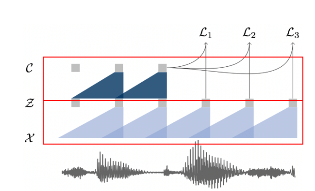
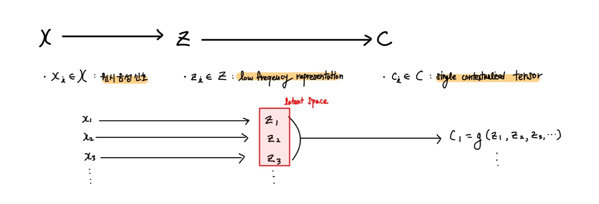
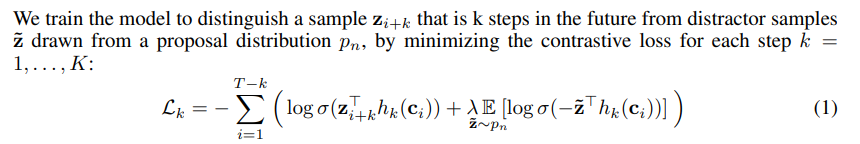
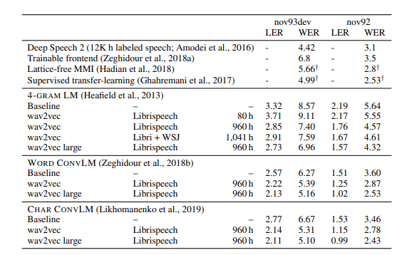
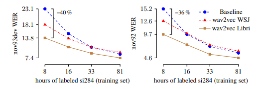
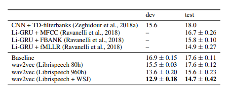

# 📌 논문 소개

**논문 이름** : `Wav2Vec`

**논문 링크** : [https://arxiv.org/pdf/1904.05862.pdf](https://arxiv.org/pdf/1904.05862.pdf)

**핵심 아이디어** : 레이블 된 데이터 없이도 풍부한 음성 특징을 추출할 수 있는 모델 제시

---

# 📄 논문 리뷰

## 0️⃣ Abstract

- `Wav2Vec`은 라벨링 되지 않은 데이터를 학습하여  음향모델의 성능을 높이는데 사용되는 `Representations`(모델이 학습한 특징, 구조 등)을 반환함.
- `Wav2Vec`은 **다중 합성곱 레이어**로 이루어짐.
- **노이즈 대조 이진 분류**를 사용함.

---

## 1️⃣ Introduction

### ◼ 기존 음성 인식 모델과 Wav2Vec의 차이점

### 1. `기존 음성 인식 모델`

- 대량의 **labeled 데이터**(음성 오디오 신호가 텍스트로 전사 되어 있는 데이터)를 통해 성능 향상
- 음성 오디오 데이터 중 labeld 된 데이터를 대량으로 구하기 어려움.

컴퓨터 비전, 자연어처리에서는 대량의 unlabeld 데이터를 사용해 일반적인 `Representation`을 학습하고, 적은 양의 labeld 데이터를 사용해 `Downstream task`에서 모델을 `미세 조정(fine-tuning)`하는 방식을 주로 사용한다.

- `Downstream task` : 모델을 사전 훈련하거나, 사전 훈련된 모델을 미세 조정한 후에 수행하는 작업. 모델을 특정 응용 프로그램이나 작업에 적용시키는 단계.

따라서, 음성 인식 모델에서도 위와 같은 방식을 적용시켜본 것이 `Wav2Vec` 모델이다.

### 2. `Wav2Vec`

- **unlabeld 데이터**를 활용한 모델
- `Unsupervised pre-training` 수행 : unlabeld 데이터를 사용해 전처리를 수행함
- **원시 오디오 신호**를 입력 받아  `Contratistive loss`를 통해 음성 인식 모델의 성능을 높이는데 활용될 수 있는 `General representation`을 반환
    - `Contratistive loss` : 주어진 입력 데이터로부터 유사한 항목을 묶고, 다른 항목을 분리하려는 작업에서 주로 사용 되는 손실함수.
    - `프레임별 음소 분류`를 위해 CNN을 사용함 : 각 프레임에서 어떤 음소가 있는지 동시에 추론하고,  병렬 작업이 가능.

---

## 2️⃣ Pre-training Approach

오디오 신호를 입력으로 받아 특성을 추론하는 임무를 수행.

- **X** : 원시 오디오 신호
- **Z** : 신호 특성

---

### 2.1 `Wav2Vec` Model



`Wav2Vec` 모델은 **두 개의 CNN**이 쌓여있는 구조이다.



- **f:X→Z** : `encoder network`
    - 5층의 CNN으로 구성 됨
    - 원시 음성신호(30ms의 16khz 오디오,stride: 10ms)를 입력 받아 low frequency feature representation(낮은 주파수 대역의 특성)으로 인코딩 함
- **g:Z→C** : `context network`
    - 9층의 CNN으로 구성 됨
    - `encoder network`에서 나온 low frequency feature representation을 single contextualze tensor로 묶어줌
- `encoder network`와 `context network` 모두 512 채널의 **causal convolution network**가 적용되었고, **group normalization** 및 **ReLU** 등이 적용
    - 5층의 CNN으로 구성 됨
    - 원시 음성신호를 입력 받아 low frequency feature representation(낮은 주파수 대역의 특성)으로 인코딩 함

---

### 2.2 Objective



- `Contrastive loss` (벡터사이에 유사성을 정량화 하는 방법)를 최소화하며 학습.
- 오디오 샘플에서 i 기준 k-step이후의 True sample을 배치 내에서 샘플링한 Negative sample과 구분하며 학습을 진행

---
### ◼ `Wav2Vec` 모델 코드 예시

```python
import torch
from fairseq.models.wav2vec import Wav2VecModel

cp = torch.load('/path/to/wav2vec.pt')
model = Wav2VecModel.build_model(cp['args'], task=None)
model.load_state_dict(cp['model'])
model.eval()

wav_input_16khz = torch.randn(1, 10000)
z = model.feature_extractor(wav_input_16khz)
c = model.feature_aggregator(z)
```

---
## 3️⃣ Experimental Setup

### 3.1 Acoustic Models( `Wav2Vec` 모델 설계(모델 비교))



SOTA(최고 수준 모델)였던 `Deep Speech 2` 보다 `Wav2Vec` 모델이 성능이 좋은 걸 확인 할 수 있음.

- **4-GRAM LM (4-Gram Language Model) :** 주어진 텍스트에서 4개의 연속된 단어를 고려하여 다음 단어를 예측하는 방식. 예를 들어, "The cat sat on the"와 같이 4개의 단어가 주어졌을 때, 다음 단어로 "mat" 또는 "chair" 등이 나올 확률을 계산.
- **WORK CONVLM (Weighted Overlap-Robustness Kernel Convolutional Language Model) :** 문장 또는 문서 수준의 텍스트를 다룸. 문맥을 이해하고 텍스트를 생성.
- **CHAR CONVLM (Character-level Convolutional Language Model) :** 문자 수준의 텍스트를 다룸.

---

### 3.2 Pre-training Models(`Wav2Vec` 모델 설계(데이터 양, 품질))



- **Baseline** : 기준 모델으로, wav2letter++이 사용 됨. pre-training 안함.
- **wav2vec WSJ** : **WSJ(Wall Street Journl)** 데이터셋에서 pre-training 된 **wav2vec** 모델. **WSJ**는 `unlabeld` 데이터이다.
- **wav2vec Libri** : **Libri(LibriSpeech)** 데이터셋에서 pre-training 된 **wav2vec** 모델.  **Libri**는 `labeld` 데이터이다.
- **labeld si284** : 라벨링 된 데이터셋. 여기서는 **si284**가 트레이닝 셋으로 사용 되었다.
- **WER** : Word Error Rate로, 음성 인식 모델의 성능 지표. 낮을 수록 더 좋은 성능.

WSJ의 데이터 양보다 Libri의 데이터 양이 더 크다. 위 그래프를 보면 WSJ를 사용한 모델이 Libri를 사용한 모델보다 성능이 안좋은 것을 볼 수 있는데, 이는 **Wav2Vec 모델이 크고 다양한 데이터셋에서 큰 성능을 보인다**는 것을 알려준다.

또한 Baseline 보다 데이터셋을 이용한 pre-training 된 모델의 성능이 좋은 것을 볼 수 있다. 따라서 **pre-training을 통해 모델은 더 큰 성능 향상**이 가능하다.

---

## 4️⃣ Results( `Wav2Vec` 모델 테스트 결과(데이터 라벨링))



- **WSJ** : **WSJ(Wall Street Journl)** 데이터셋. **WSJ**는 `unlabeld` 데이터이다.
- **LibriSpeech** : **LibriSpeech** 데이터셋.  **LibriSpeech**는 `labeld` 데이터이다.

**LibriSpeech** 데이터셋 만을 사용할 때 보다, **WSJ**를 함께 사용했을때 성능이 가장 좋았다. 이는 **다양한 데이터셋이 성능향상에 기여**한다는 것을 보여줌과 동시에, `unlabeld` **데이터를 효율적으로 사용**할 수 있음을 보여준다.

```toc

```