## 🥰 출처

- [https://halfundecided.medium.com/딥러닝-머신러닝-cnn-convolutional-neural-networks-쉽게-이해하기-836869f88375](https://halfundecided.medium.com/%EB%94%A5%EB%9F%AC%EB%8B%9D-%EB%A8%B8%EC%8B%A0%EB%9F%AC%EB%8B%9D-cnn-convolutional-neural-networks-%EC%89%BD%EA%B2%8C-%EC%9D%B4%ED%95%B4%ED%95%98%EA%B8%B0-836869f88375)
- [https://idplab-konkuk.tistory.com/13](https://idplab-konkuk.tistory.com/13)

---

## 🤔 CNN이 무엇일까?

Convolutional Neural Networks의 약자인 CNN은 딥러닝에서 주로 이미지나 영상 데이터를 처리할 때 쓰인다.

이름에서 알 수 있다시피 `Convolution`(하나의 함수와 또 다른 함수를 반전 이동한 값을 곱한 다음, 구간에 대해 적분하여 새로운 함수를 구하는 방식 : **합성곱**)이라는 전처리 작업이 들어가는 Neural Network 모델이다.

### 💙 CNN의 필요성과 등장

일반 DNN(Deep Neural Network)는 기본적으로 1차원 형태의 데이터를 사용한다. 때문에 2차원 형태인 이미지(ex : 1028x1028)가 입력값이 되는 경우, 이것을 flatten 시켜서 한 줄의 데이터로 만들어야 한다. 이때 생기는 문제점은 다음과 같다.

- flatten의 과정에서 이미지의 공간적/지역적 정보의 손실
- 추상화 과정 없이 바로 연산과정으로 넘어가 버리기 때문에 학습시간과 능률의 효율성이 저하된다.

CNN은 이미지를 날 것(raw input) 그대로 받음으로써 공간적/지역적 정보를 유지한 채 특성(feature)들의 계층을 빌드업한다.

### 💙 CNN의 사용

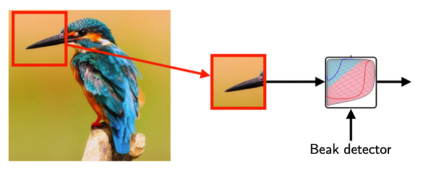

어떠한 이미지가 주어졌을 때 이것이 새의 이미지인지 아닌지 결정할 수 있는 모델을 만들고 싶다고 가정한다. 우리가 집중해야 할 부분은 새의 부리이다! 때문에 모델이 주어진 이미지에 새의 부리가 있는지 없는지 판가름 하는 것이 중요 척도가 될 것이다.

이때, 전체 사진을 모두 분석하는 것보다 새의 부리 **부분만 잘라보는 것**이 더 효율적이다. 이러한 역할을 **CNN**이 해준다!

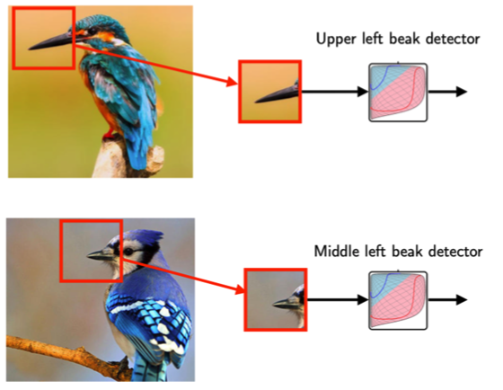

또한 사진마다 새의 부리가 위치하는 영역이 다르다. 위의 이미지는 새의 부리가 이미지의 왼쪽 상단에 위치한 반면, 아래의 이미지는 상단 가운데 부분에서 약간 왼쪽 부분에 위치한다.

따라서 전체적인 이미지 보다는 이미지의 부분 부분을 캐치하는 것이 중요하고 효율적이다.

## 😏 CNN의 주요 컨셉들

### ❤️ Convolution의 작동 원리

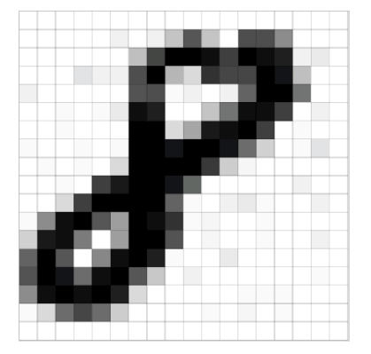

위의 이미지는 MNIST Dataset에서 추출한 샘플 중 하나이며 손글씨로 쓰여진 ‘8’의 gray scale 이미지 이다. 보다시피 2차원 이미지는 픽셀 단위로 구성된 것을 알 수 있다. 위의 이미지 같은 경우에는 28*28단위의 픽셀로 구성되어 있는데, 이는 28*28 matrix(행렬)로 표현할 수 있다는 말이다.

**CNN에 넣어줄 입력 값은 matrix로 표현된 이미지이다.**

CNN에 이미지 입력값을 넣는 방법을 예를 들어 설명해보자!

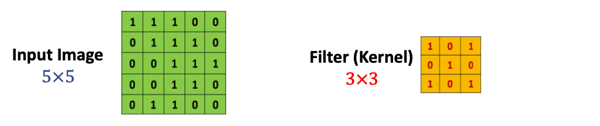

Input으로 5*5의 matrix로 표현된 이미지 입력값이 주어진다고 가정하자. CNN에는 필터(커널)가 존재하는데, 이 필터를 Input 데이터 값에 훑어주면서 전체적으로 필터를 씌어준다.

필터가 씌어지면 연산처리가 이루어지는데, 이 연산처리는 matrix와 matrix간의 `Inner Product` 를 사용한다.

- `Inner Product` 란,

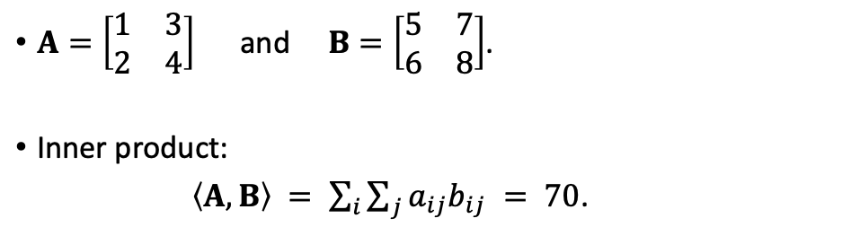

같은 크기의 두 행렬을 놓고 각 위치에 있는 숫자를 모두 곱해 더해주는 것이다.

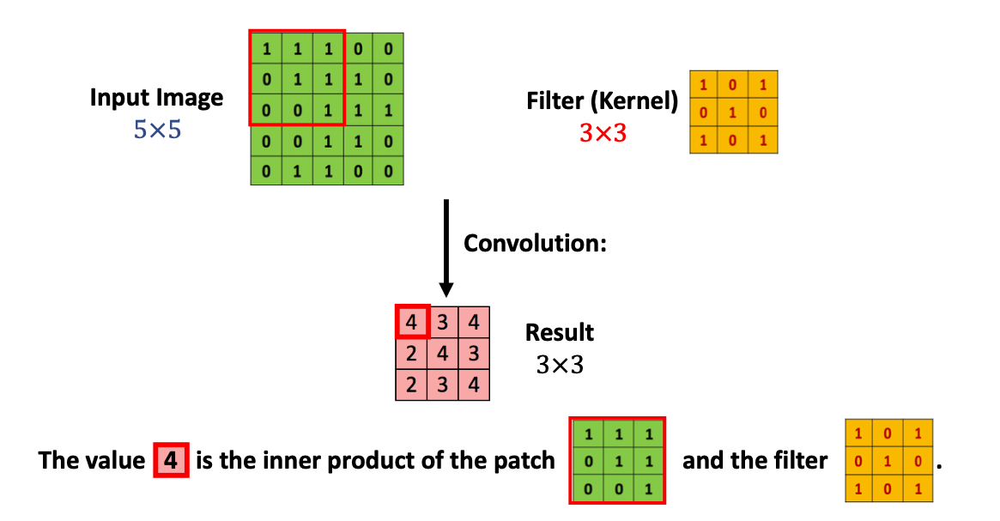

Input Image의 빨간색 테두리 부분의 matrix와 필터의 `Inner product` 연산을 해주면 그 결과 값은 Result의 빨간색 테두리 값과 같이 ‘4’가 됩니다. 그리고 필터를 한 칸 옆으로 옮겨주면,

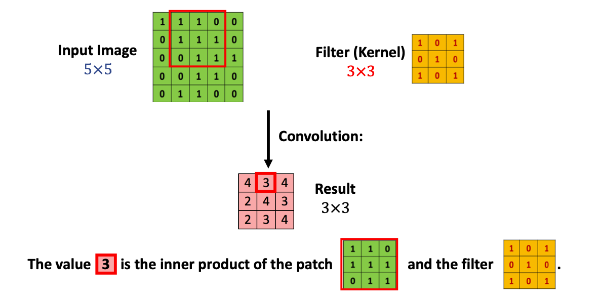

또다시 빨간색 테두리 안과 필터와의 연산을 통해 Result 값을 도출해냅니다. 이렇게 반복하여 얻어낸 결과 값이 분홍색으로 표시된 matrix입니다.

Result의 dimension(matrix의 크기)은 3*3입니다. 이는 5*5로 구성된 칸 안에 3*3 크기의 블록을 움직인다면 오른쪽으로 세 칸, 아래쪽으로 세 칸 갈 수 있기 때문입니다.

### ❤️ Zero Padding

방금 살펴본 Convolution처리를 보면 5*5 크기의 이미지에 필터 처리를 해주었더니 결과값의 크기가 3*3으로 줄어들었다는 것을 알 수 있습니다. 이를 **손실 되는 부분이 발생하였다**고 합니다.

이러한 문제점을 해결하기 위해 `Padding` 이라는 방법을 사용합니다.

`Padding` 은 0으로 구성된 테두리를 Input 이미지 가장자리에 감싸주는 것입니다.

그렇다면 위의 경우 Input 값이 7*7 이 되므로 이 상태에서 3*3 필터를 적용해줄 경우 똑같이 5*5 크기의 결과 값을 얻을 수 있습니다.

**결국, 입력 값의 원래 크기와 결과 값의 크기가 같아졌다. 즉, 손실이 없어졌음을 알 수 있습니다.**

### ❤️ Stride

Stride는 쉽게 말해 필터를 얼마만큼 움직여 주는가에 대한 것입니다. Stride 값이 1인 경우, 한 칸씩 움직여 준다고 생각하면 됩니다.

Stride-1이 기본 값이고, Stride는 1보다 큰 값이 될 수 도 있습니다. Stride값이 커질 경우 필터가 이미지를 건너뛰는 칸이 커짐을 의미하기 때문에 결과 값 이미지의 크기는 작아집니다.

### ❤️ The Order-3 Tensor

2차원의 이미지는 `matrix`, `order-2 텐서`라고도 칭합니다. 그럼 `order-3 텐서`는 3차원의 입력값이겠죠?

예를 들어 컬러 이미지와 같은 경우에는 RGB 세 가지 채널로 구성되어 있기 때문에 3차원의 크기를 가집니다.

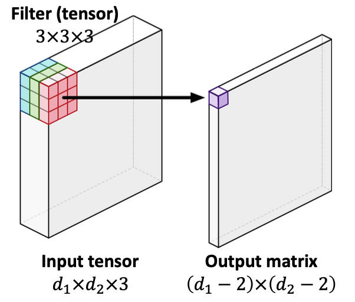

order-3 텐서를 `Inner product` 처리하면 결과 값은 order-3 텐서, 즉 matrix 모양이 됩니다.

## 😁 CNN의 전체적인 네트워크 구조

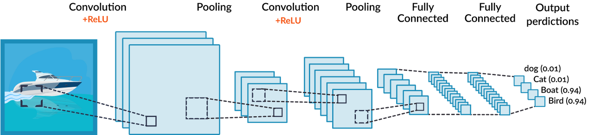

### 💛 컨볼루션(Convolution) 층

Convolution층은 특징을 추출하는 층이다. 일정 영역의 값들에 대해 가중치를 적용하여 하나의 값을 만드는 연산인 `Inner product` 연산을 실행한다. 

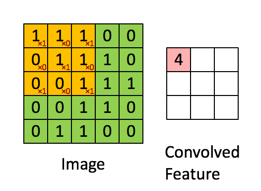

위의 노란색 필터 부분을 커널, 마스크라고도 부른다.

가중치 필터 연산 후에 활성화 함수를 적용하여 이후 연산에 넘겨진다. 이때 CNN의 경우 대부분 `ReLU` 활성화 함수를 사용한다.

### 💛 풀링(Pooling) 층

풀링층은 일정 크기의 블록을 통합하여 하나의 대표값으로 대체하는 연산이다. Convolution층에서 출력된 특징지도(Convolved Feature)를 압축하여 특정 데이터를 강조하는 역할을 한다.

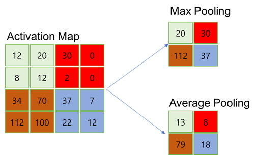

풀링 방식은 다음과 같다.

- `Max Pooling`
    - 블록 내의 원소들 중 최대 값을 대표 값으로 선택한다.
- `Average Pooling`
    - 블록 내의 원소들의 평균 값을 대표 값으로 선택한다.
- `Stochastic Pooling`
    - 블록 내 원소의 크기를 선택 확률로 변환 후 확률에 따라 선택한다.
    

일반적으로 CNN에서는 `Max Pooling` 기법을 대중적으로 사용한다.

Conv층과 Pooling층의 반복된 연산으로 입력 이미지 배열은 특징들만을 포함한 하나의 1차원 배열 데이터로 변환된다.

이후에는 다중 퍼셉트론 층(Fully Conneted Layer)을 통해 연산이 수행되고 회귀 혹은 분류(SoftMax 층 필요)가 이루어진다.

```toc

```