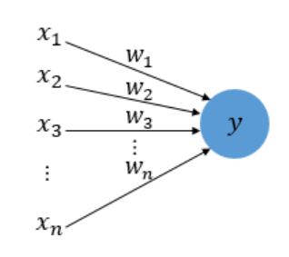
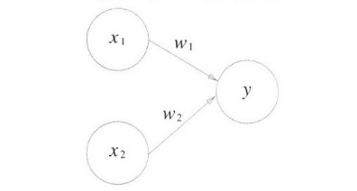
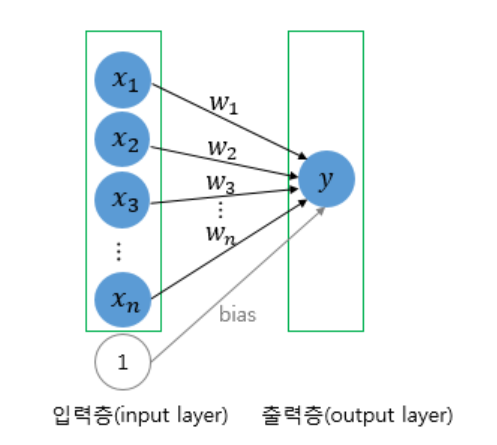
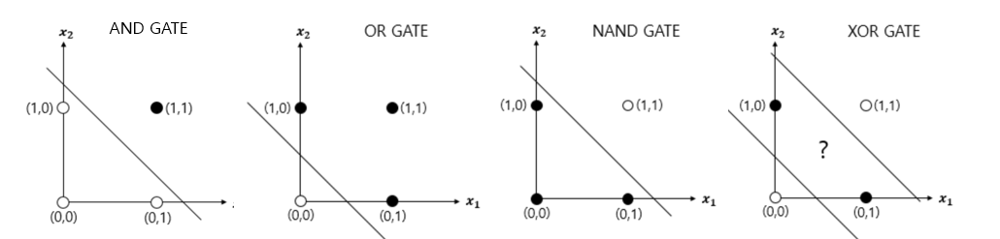
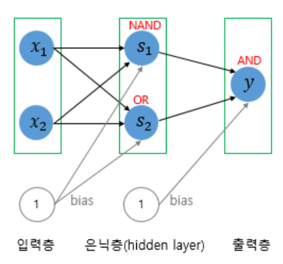

## 😍 출처

- 사이토 고키, 밑바닥부터 시작하는 딥러닝, 한빛미디어
- [07-01 퍼셉트론(Perceptron) - 딥 러닝을 이용한 자연어 처리 입문 (wikidocs.net)](https://wikidocs.net/24958)


---

## 🤗 퍼셉트론(perceptron)이란?



퍼셉트론은 프랑스 로젠블라트(Frank Roseblatt)가 1957년에 고안한 알고리즘으로, 신경망(딥러닝)의 기원이 되는 알고리즘이다.

- 다수의 `신호`를 입력으로 받아 하나의 `신호`를 출력
- `신호` : 전류가 흐르듯 흐름이 있는 것
- 퍼셉트론 신호는 1/0 의 두 가지 값을 가짐
- 1 : 신호가 흐른다
- 0 : 신호가 흐르지 않는다

## 🤭 퍼셉트론의 구조와 동작원리



위 그림은 **입력으로 2개의 신호를 받은 퍼셉트론** 이다.

- x1과 x2 : 입력신호
- y : 출력신호
- w1과 w2 : 가중치(weight)
- 그림의 원 : 뉴런(노드)

입력신호를 받아, 가중치를 곱하여, 출력하는 형태로 이루어져있다.

뉴런에서 보내온 신호의 총합이 `임계값`(정해진 한계, θ)를 넘어설 때에만 `뉴런이 활성화` 되고, `1` 을 출력한다.


- 퍼셉트론은 복수의 입력 신호 각각에 고유한 가중치를 부여
- 가중치는 `각 신호가 결과에 주는 영향력`을 조절
- 가중치가 크다 = 신호가 중요하다

## 🙄 퍼셉트론의 종류

퍼셉트론은 `단층 퍼셉트론`과 `다층 퍼셉트론`으로 나누어진다.

### 1) 단층 퍼셉트론(Single-Layer Perceptron)



단층 퍼셉트론은 `값을 보내는 단계`와 `값을 받아서 출력하는 단계` 로 나뉘어진다.

- 각 단계를 `층`(layer)이라고 함
- 입력 값을 받는 층을 `입력층`(input layer)
- 출력 값을 도출하는 층을 `출력층`(output layer)
- 단층 퍼셉트론은 AND 게이트, NAND 게이트, OR 게이트를 구현(**XOR 게이트는 불가능**)
- 단층 퍼셉트론은 직선 하나로 두 영역을 나눌 수 있는 문제에 대해서만 구현이 가능



### 2) 다층 퍼셉트론(MulyiLayer Perceptron, MLP)



위 그림은 XOR 게이트를 구현한 다층 퍼셉트론이다. 다층 퍼셉트론은 `은닉층`이 추가되어 있는 형태를 가진다.

- 다층 퍼셉트론은 `은닉층`이 1개 이상인 퍼셉트론
- 은닉층의 개수는 사용자가 설정하기 나름

```toc

```