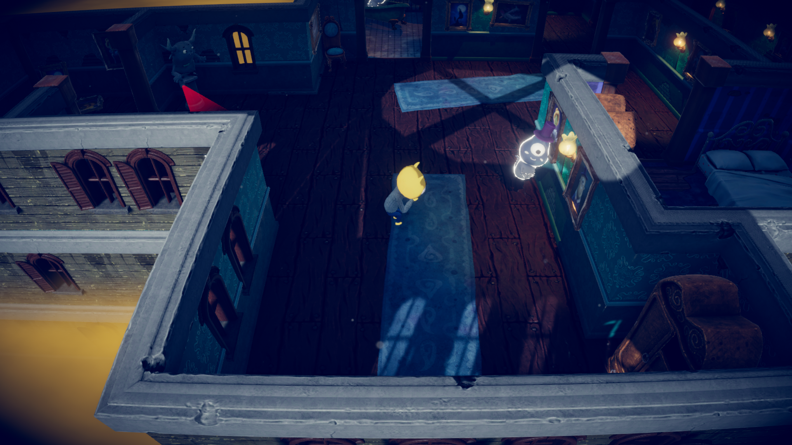
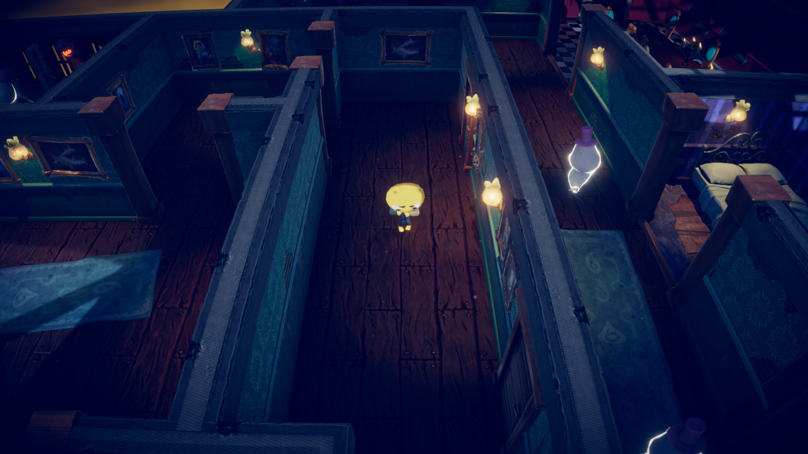

---
emoji: 👻
title: "[Unity] 존 레몬의 공포 체험: 3D 초급자용"
date: '2023-01-08 20:54'
author: 쭈이
tags: Unity
categories: Unity
---

## 💌 존 레몬의 공포 체험 이란?

[▶ 존 레몬의 공포 체험 - Unity Learn 튜토리얼 링크](https://learn.unity.com/project/jon-remonyi-gongpo-ceheom-3d-cogeubjayong?uv=2020.3)

Unity에서 공식적으로 제공하는 게임 튜토리얼 ‘존 레몬의 공포 체험: 3D 초급자용 프로젝트’를 제작하였다. Unity hub에서 에셋을 다운 받고, 캐릭터의 애니메이션을 조정하는 등 실제 게임에 필요한 요소(적, 게임오버, 게임 클리어 판정)를 실습할 수 있다.

---

## 🤍 발생했던 문제

### 🧛‍♀️ 유령이 멈춤

이게 무슨 말이냐면, 사진의 오른쪽에 있는 흰색 유령이 정해진 위치를 일정하게 움직이면서 플레이어를 방해해야 하는데! 몇 명의 유령이 조금 움직인 뒤, 자리에 멈춰서는 문제가 발생했다.

유령은 다음과 같은 로직으로 구성되어있다.

1) 유령 프리팹을 사용하여 여려 명의 유령 생성

2) 내비 메시 에이전트를 동시에 적용

3) ‘Waypoint’라는 에셋을 만들어 해당 에셋의 좌표를 순차적으로 계속 돌아다니게 함.

로직을 보면 알다시피, 프리팹을 사용하였고, 내비 메시 에이전트를 사용하여서 사실 멈추려면 다 같이 멈춰야지, 몇 개는 되고, 몇 개의 유령만 멈춘다는 건 말도 안되는 일이다!

이 문제 때문에 새벽을 새워 파악해본 결과… **‘Waypoint’의 좌표 설정 문제였다.**

---

### 💫 상대좌표와 절대좌표

Unity에서는 두 가지의 좌표계가 존재한다. 첫 번째는 `상대좌표`, 두 번째는 `절대좌표`.

- `상대좌표`
    
    오브젝트의 계층적 구조에서 발생하는 좌표. 한 오브젝트의 하위에 존재하면, 하위의 오브젝트는 상위 오브젝트에 대한 상대적인 좌표값을 가진다.
    
- `절대좌표`
    
    우리가 아는 일반적인 좌표를 말한다.
    

바로 이 몇 개의 ‘Waypoint’가 `상대좌표`를 따르고 있던 것! 일반적으로 Duplicate를 사용하여 만들었는데 도대체 상위 오브젝트도 없는 오브젝트가 왜 `상대좌표`를 따르고 있었는진 모르겠지만…

아무튼, 튜토리얼에 지정된 좌표를 설정하면 ‘유령의 집’ 바깥으로 좌표가 지정되는 오류가 있었다. 그래서 유령은 갈 길을 잃었던 것…

아래 사진들은 쓸쓸하게 멈춰 있는 우리 유령들이다.





---

## 🤍 개인적 생각

- 내비 메시 에이전트라는 기능을 이제 알게되어 슬프다. 유용하게 쓰일 것 같다!
- 게임 내부의 조명을 설정하는 과정에서 등장하는 전문 용어들을 조금 이해하게 된 것 같다. 앞으로도 신경쓰며 실습할 것.
- 3인칭으로 플레이어를 따라다니는 기능이 Unity 내부에 존재하는 것을 알게 됨!

---

## ❤ 깃허브 링크
[▶ 깃허브 링크](https://github.com/JuHuiHeo/John_lemon_3d)

```toc

```