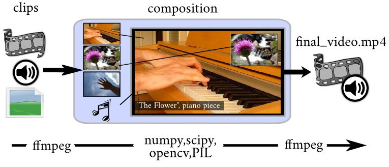

## 🥰 참고자료

- [https://chacha95.github.io/2019-10-24-Movipy/](https://chacha95.github.io/2019-10-24-Movipy/)
- [https://ichi.pro/ko/moviepyleul-sayonghayeo-python-eulo-gibon-bidio-pyeonjib-sopeuteuweeoleul-mandeubnida-277842123636572](https://ichi.pro/ko/moviepyleul-sayonghayeo-python-eulo-gibon-bidio-pyeonjib-sopeuteuweeoleul-mandeubnida-277842123636572)
- [https://yujuwon.tistory.com/entry/python에서-동영상-처리하기](https://yujuwon.tistory.com/entry/python%EC%97%90%EC%84%9C-%EB%8F%99%EC%98%81%EC%83%81-%EC%B2%98%EB%A6%AC%ED%95%98%EA%B8%B0)


---


## 😏 Moviepy란?

Moviepy란 파이썬을 이용한 video processing에 최적화 된 라이브러리다. 한 줄 코드로 직관적이면서도 빠르게 비디오 및 오디오의 합성이나 애니메이션, GIF 파일 생성 등을 할 수 있다.

### 🤔 Moviepy의 특징

- 간단하며 직관적이다.
- flexible, protable 하다.
- numpy와 호환 된다.
- stream video에 대한 작업에는 적합하지 않다.
- **비디오의 개수가 많을 경우(100개 이상) 적합하지 않다.**
    
    
    
- **ffmpeg**를 이용해 비디오와 오디오를 읽고 쓴다.
- 읽어들인 정보들은 numpy, scipy와 같은 라이브러리를 이용해 편집이 가능하다.

## 😊 설치

```python
(sudo) pip install moviepy
(sudo) python setup.py install
```

python에서 동작할 수 있는 ffmpeg 또한 함께 설치 해야 한다.

```python
import imageio
imageio.plugins.ffmpeg.download()
```

## 🤩 주요 기능

- `VideoClips`
    - 기본 class이다.
    
- `ImageClip`
    - `VideoClip` 보다 user-friendly한 class이다.
    - 주어진 이미지를 정해진 시간 동안 화면에 display 해준다.
    - 이어진 이미지를 합쳐 `VideoFileClip class`로 합칠 수 있게 만들어준다.
    
    ```python
    vid = ImageClip(vid_frame).set_duration(1)
    ## image를 한 장 넣고, set_duration를 통해 이미지를 몇 초 보일 것인지 지정한다.
    ## 지정된 시간 동안 한 장의 이미지를 디스플레이하는 video가 생성된다.
    ```
    

- `VideoFileClip`
    - `VideoClips class` 보다 user-friendly한 클래스이다.
    - 대부분의 예제코드가 `VideoFileClip class`를 이용한다.

- `AudioFileclip`
    - audio file이나 video file에서 **오디오를 추출**한다.
    
    ```python
    from moviepy.editor import *
    videoclip = VideoFileClip("myvideo.mp4")
    audioclip = videoclip.audio
    ```
    

- `get frame`
    - movipy 내장 함수를 이용해 **특정 초의 frame을 numpy array로 추출**한다.
    - `get frame` 함수를 이용한다.
    
    ```python
    ## get frame 함수를 이용해 특정 시간대의 frame 추출
    img = vid_clip.get_frame(10)
    ```
    

- `concatenate_videoclips`
    - 여러 비디오 clip을 읽어 온 뒤, **비디오들을 합쳐준다.**
    - `subclip`
        - 정해진 시간 초 내의 frame을 불러온다.
    - `concat`
        - 비디오를 합쳐준다.
    
    ```python
    from moviepy.editor import VideoFileClip, concatenate_videoclips
    clip1 = VideoFileClip("myvideo.mp4")
    # subclip을 이용해 정해진 시간 초 내의 frame만 불러옵니다.
    clip2 = VideoFileClip("myvideo2.mp4").subclip(50,60)
    clip3 = VideoFileClip("myvideo3.mp4")
    # concat함수를 이용해 비디오를 합쳐줍니다.
    final_clip = concatenate_videoclips([clip1,clip2,clip3])
    final_clip.write_videofile("my_concatenation.mp4")
    ```
    
- **서로 다른 video와 audio 합성**
    
    ```python
    from moviepy.editor import *
    videoclip = VideoFileClip("myvideo.mp4").subclip(1, 10)
    audioclip = AudioFileClip("audioname.mp3").subclip(1, 10)
    
    videoclip.audio = audioclip
    videoclip.write_videofile("new video.mp4")
    ```
    
- **Memory 지우기**
    - 여러 개의 비디오를 처리 할 경우, ram 메모리 공간이 부족할 때 사용한다.
    
    ```python
    # close 함수를 이용해 비디오를 닫아줍니다.
    video_clip.close()
    ```
    
- **overflow 방지**
    - 여러 video clip을 합칠 때, overflow를 방지해주는 코드이다.
    
    ```python
    parent_clip = VideoFileClip("./parent_video.mp4")
    clip_list = []
    for part in time_parts:
        time_start = part[0]
        time_end = part[1]
        clip_list.append(
            parent_clip.subclip(time_start, time_end)
        )
    concat_clip = concatenate_videoclips(clip_list)
    ```

```toc

```