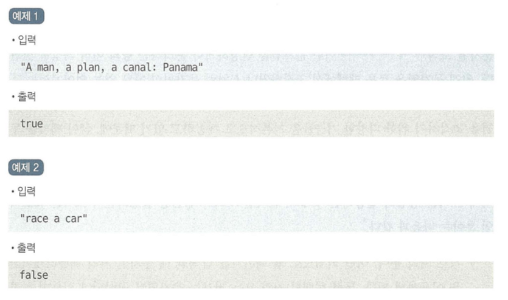
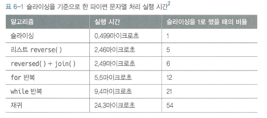

## 👩‍💻문제

주어진 문자열이 팰린드롬인지 확인하라. 대소문자를 구분하지 않으며, 영문자와 숫자만을 대상으로 한다.



## 😊풀이 1) 리스트로 변환

```python
class Solution:
    def isPalindrome(self, s: str) -> bool:
        strs = []
        for char in s:
            # isalnum() : 영문자, 숫자 여부를 판별하는 함수
            if char.isalnum():
                strs.append(char.lower())

        # 팰린드롬 여부 판별
        while len(strs) > 1 :
            if strs.pop(0) != strs.pop():
                return False

        return True
```

### 📌 얻어갈 점

1) `isalnum()` : 영문자, 숫자 여부를 판별하는 함수

2) 파이썬의 리스트는 pop() 함수에서 인덱스를 지정 가능

## 😊풀이 2) 데크 자료형을 이용한 최적

```python
class Solution:
    # 자료형 데크로 선언
		strs : Deque = collections.deque()
		
		for char in s :
				if char.isalnum():
					strs.append(char.lower())

		while len(strs) > 1:
				if strs.popleft() != strs.pop():
						return False
	
		retrun True
```

### 📌 얻어갈 점

1) [[Python] 데크(deque)와 리스트(list)](https://master--heojuhuigitblog.netlify.app/Python-deque-list/)

2) 리스트에서는 pop(0), 데크에서는 popleft() 사용

3) 데크는 O(1), 리스트는 O(n)이므로 데크의 속도가 훨씬 빠름

## 😊풀이 3) 슬라이싱 사용

```python
# 펠린드롬 판별 부분만 구현

def isPalindrome(self, s: str) -> bool:
		s = s.lower()
		## 정규식으로 불필요한 문자 필터링(영어와 숫자만 필터링)
		s = re.sub('[^a-z0-9]', '', s)

		# 문자열을 뒤집는 슬라이싱
		return s == s[::-1]
```

### 📌 얻어갈 점

1) `re.sub`는 정규 표현식이다.([[Python] 정규 표현식과 re 모듈](https://master--heojuhuigitblog.netlify.app/python-remodule/))

- `re 모듈` : 파이썬에서 정규 표현식을 사용할 때 쓸 수 있는 모듈

```python
#re 모듈 사용하기
import re
```

- `re.sub` : sub는 정규식과 매치되는 부분을 다른 문자로 바꾸는 메서드

```python
re.sub('[^a-z0-9]', '', s)
# s 문자열 안의 값 중,
# 'a부터 z까지([a-z])', '0부터 9까지([0-9])'가 아닌(^) 값은
# 공백(' ')으로 치환하라
```

2) s[::-1] : 문자열을 뒤집는 방법 중 하나

3) 파이썬의 정규식과 슬라이싱을 이용하면 더 좋은 속도와 간결한 코드 구현 가능

4) 문자열 슬라이싱을 사용하는 이유

- 슬라이싱은 위치를 지정하면 해당 위치의 배열 포인터를 자동으로 얻을 수 있다.
- 문자열을 별도 자료형으로 매핑하는 등의 처리 과정을 거치지 않는다.
- 대부분의 문자열 작업은 슬라이싱으로 처리하는 편이 가장 빠르다.


```toc

```