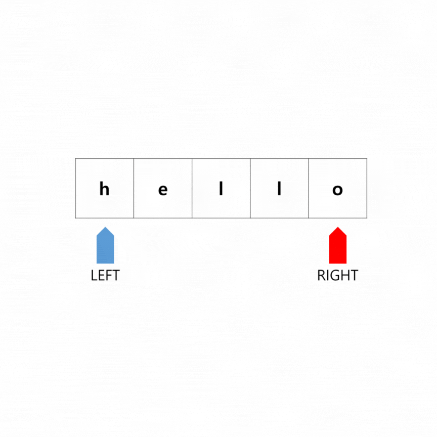

## 👩‍💻문제

문자열을 뒤집는 함수를 작성하라. 입력값은 문자 배열이며, 리턴 없이 리스트 내부를 직접 조작하라.

## ❤직접 풀이

### 🤍 생각의 흐름

파이썬에서 문자열을 뒤집는 가장 보편적인 방법을 사용한다.

```python
class Solution:
    def reverseString(self, s: List[str]) -> None:
        s = s[::-1]
```

하지만 Wrong Answer로 판별 된다…

그럼 reverse() 함수를 사용한다.

```python
class Solution:
    def reverseString(self, s: List[str]) -> None:
        s.reverse()
```

깔끔하게 해결된다!

## 😊 파이썬 알고리즘 인터뷰 풀이 1) 투 포인터를 이용한 스왑

```python
def reverseString(self , s: List[str]) -> None:
		left , right = 0, len(s) - 1
		while left < right:
				s[left] , s[right] = s[right] , s[left]
				left += 1
				right -= 1
```



### 📌 얻어갈 점

1) 아주 전통적인 풀이 방식이다.

## 😊 파이썬 알고리즘 인터뷰 풀이 2) 파이썬 다운 방식

```python
def reverseString(self , s: List[str]) -> None:
		s.reverse()
```

### 📌 얻어갈 점

1) reverse()는 리스트에만 제공된다.

2) s[::-1]가 안된다고 했더니 알고보니 변수 할당을 처리하는 데 제약이 있다고 한다…

3) s[:] = s[::-1]은 잘 돌아간다고 하는데… 이걸 어케…?