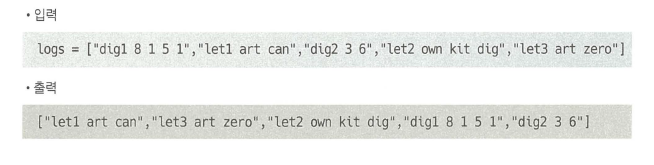

## 👩‍💻문제

로그를 재정렬하라. 기준은 다음과 같다.

1. 로그의 가장 앞 부분은 식별자다.
2. 문자로 구성된 로그가 숫자 로그보다 앞에 온다.
3. 식별자는 순서에 영향을 끼치지 않지만, 문자가 동일할 경우 식별자 순으로 한다.
4. 숫자 로그는 입력 순서대로 한다.



---

## ❤ 직접 풀이

### 🤍 생각의 흐름

1. 공백 기준으로 split
2. 식별자와 문자로그, 숫자로그를 분리해서 생각(문자, 숫자 판별이 필요)
3. 람다 표현식 쓰면 될텐데 난 람다 표현식 모른다…

### 🤍 split과 join, sort를 이용한 풀이

```python
logs = ["dif1 8 1 5 1", "let1 art can",
        "dig2 3 6", "let2 own kit dig", "let3 art zero"]

def checkLogs(l):
    str_list = []
    num_list = []

    for log in l:
        if log.split(" ")[1].isdigit() :
            num_list.append(log)
        else :
            str_list.append(log)

    str2_list = []
    
    for log in str_list:
        a = log.split(" ")[0]
        b = log.split(" ")[1:]
        str2_list = " ".join(b)
        
    str2_list.sort()
```

딕셔너리를 사용할 정도의 지저분함을 느끼며 종료… 역시 람다 표현식을 사용해야 할 것 같다.

### 🤍 split과 join, sorted(lambda) 이용한 풀이

```python
def checkLogs(l):
    str_list = []
    num_list = []

    for log in l:
        if log.split(" ")[1].isdigit() :
            num_list.append(log)
        else :
            str_list.append(log)

    a = sorted(str_list, key=lambda x: (x.split()[1], x.split()[0]))

    result = a + num_list

    return result
```

---

## 😊 파이썬 알고리즘 인터뷰 풀이 1) 람다와 + 연산자를 이용

```python
def reorderLogFi.les(self , logs: List[str]) -> List[str]:
		letters, digits = [], []
		for log in logs:
				lf log.split( )[l].isdiglt():
						digits.append(log)
				else:
						letters.append(log)

		# 2개의 키를 람다 표현식으로 정렬
		letters.sort(key=lambda x: (x.split()[1], x.split()[0]))
		return letters + digits
```

### 📌 얻어갈 점

1) 람다 표현식은 필수다… 람다 표현식 공부해 둘 것!

2) 람다 표현식에 대해 잘 정리되어 있는 블로그 링크를 첨부한다. ([https://gorokke.tistory.com/38](https://gorokke.tistory.com/38))

```toc

```