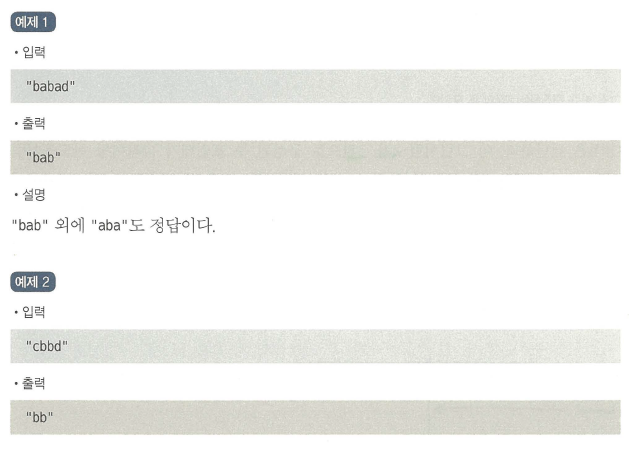

## 👩‍💻문제

가장 긴 팰린드롬 부분 문자열을 출력하라



## 😊풀이 1) 중앙을 중심으로 확장하는 풀이(투포인터)

```python
def longestPalindrome(s):
		# 팰린드롬 판별 및 투 포인터 확장
    def expand(left, right):
				# 포인터의 범위 : left 부터 right - 1 까지
				# 포인터의 양쪽 끝이 배열 s 안에 포함 되고(left >= 0 and right <= len(s))
				# 포인터의 내부 문자열이 팰린드롬 이면(s[left] == s[right -1])
        while left >= 0 and right <= len(s) and s[left] == s[right - 1]:
            left -= 1
            right += 1
        return s[left + 1:right -1]

    # 예외처리 : 공백 또는 한 글자(ex: 'a', 'b', '')
		#           or 애초에 팰린드롬으로 주어진 경우('aba', 'bb', 'abbcbba')
    if len(s) < 2 or s == s[::-1]:
        return s
            
    result = ''
		# 슬라이딩 윈도우 우측으로 이동
    for i in range(len(s) -1):
				# expand(i, i+1) : 팰린드롬이 홀수인 경우
				# expand(i, i+2) : 팰린드롬이 짝수인 경우
        result = max(result, expand(i, i+1), expand(i, i+2), key = len)
  
    return result
```

### 📌 얻어갈 점

1) `max` 함수에서 key인자를 사용할 수 있다.([[Python] max함수와 선택인자(key, default)](https://master--heojuhuigitblog.netlify.app/python-max(key,%20default)/))

2) 예외처리를 통해서 코드의 속도를 향상 시킬 수 있다.
```toc

```