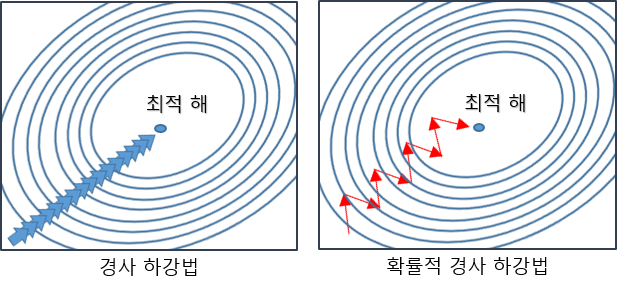
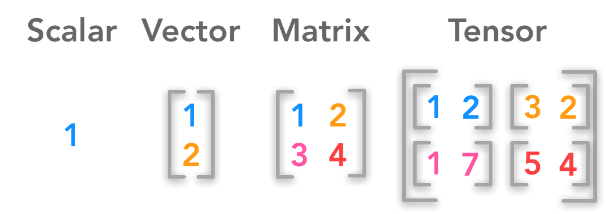
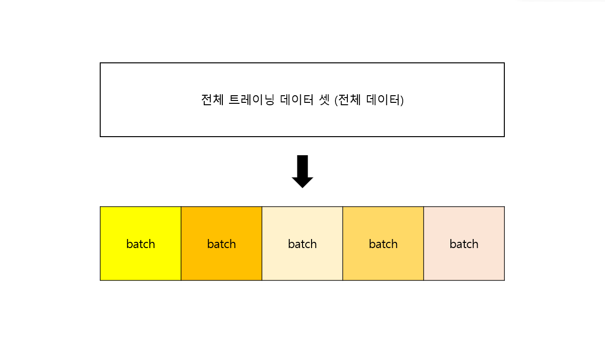
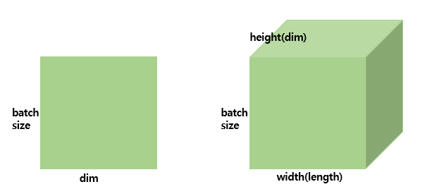
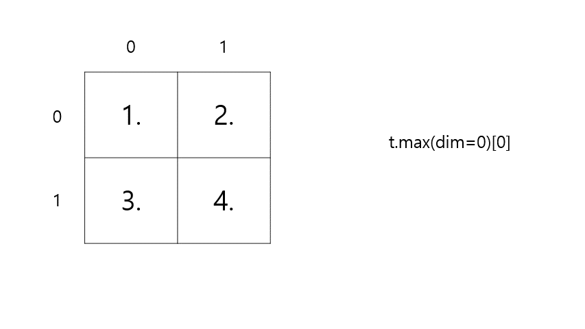
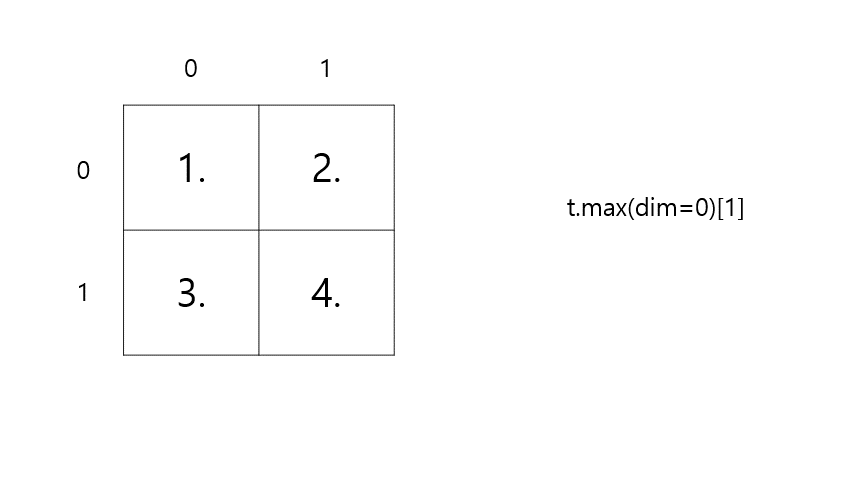
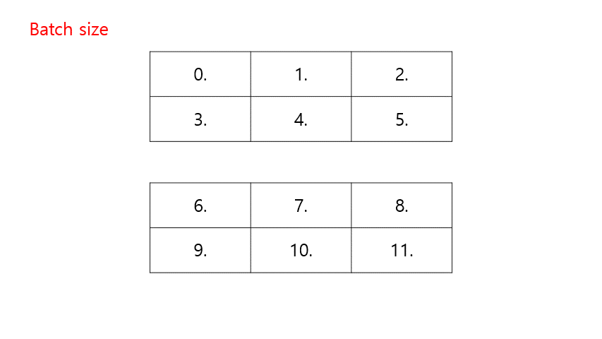
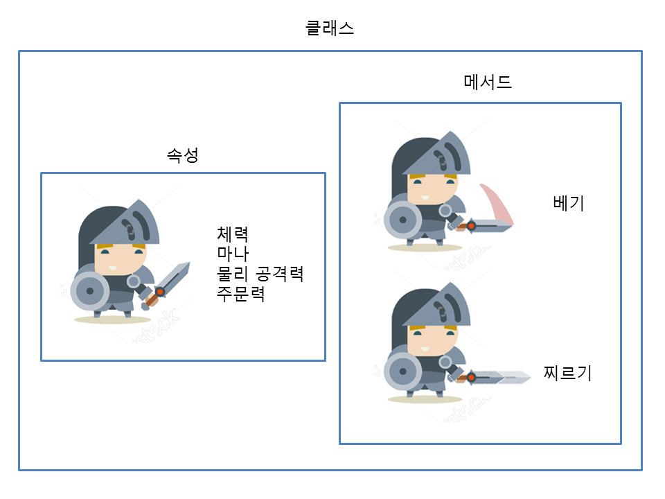

## 🥰 참고

- [https://sdc-james.gitbook.io/onebook/3./3.7.-modules/3.7.2.-namespace-scoping](https://sdc-james.gitbook.io/onebook/3./3.7.-modules/3.7.2.-namespace-scoping)
- [https://go-hard.tistory.com/11](https://go-hard.tistory.com/11)
- [https://gaussian37.github.io/dl-pytorch-deploy/](https://gaussian37.github.io/dl-pytorch-deploy/)
- [https://art28.github.io/blog/linear-algebra-1/](https://art28.github.io/blog/linear-algebra-1/)
- [https://eda-ai-lab.tistory.com/394](https://eda-ai-lab.tistory.com/394)
- [https://bskyvision.com/896](https://bskyvision.com/896)
- [https://wikidocs.net/60034](https://wikidocs.net/60034)

---

## 🤔 Ch2. 파이토치 기초(PyTorch Basic)

---

### 🙃 01) 파이토치 패키지의 기본 구성

1. **torch**
    
    메인 `네임스페이스`이다. 
    
    `네임스페이스` 란, 임의의 변수들이 모여있는 공간이다. 전체 프로그래밍 공간에서 변수들의 이름이 겹칠 수도 있으므로, `네임스페이스`를 할당하여 변수 이름이 통용될 수 있는 범위를 제한한다. (예시 : ‘레드벨벳’ 아이린 / ‘모델’ 아이린. 여기에서 ‘레드벨벳’과 ‘모델’이 일종의 `네임스페이스`라고 할 수 있다.)
    
    텐서 등의 다양한 수학 함수가 포함되어져 있으며 Numpy와 유사한 구조를 가진다.
    
2. **torch.autograd**
    
    자동 미분을 위한 함수들이 포함되어 있다. 자동 미분의 on/off를 제어하는 콘텍스트 매니저(enable_grad/no_grad)나 자체 미분 가능 함수를 정의할 때 사용하는 기반 클래스인 ‘Function’ 등이 포함되어 있다.
    
3. **torch.nn**
    
    신경망을 구축하기 위한 다양한 데이터 구조나 레이어 등이 정의되어 있다.
    
    RNN, LSTM과 같은 레이어, ReLU와 같은 활성화 함수, MESLoss와 같은 손실 함수들이 저장되어 있다.
    
4. **torch.optim**
    
    `확률적 경사 하강법`(Stochastic Gradient Descent, `SGD`)를 중심으로 한 파라미터 최적화 알고리즘이 구현되어 있다.
    
    
    
    그림과 같이 `확률적 경사 하강법`은 전체 데이터를 사용하는 것이 아니라, 랜덤하게 추출한 일부 데이터를 사용한다. 따라서 학습 중간 과정에서 결과의 진폭이 크고 불안정하며, 속도가 매우 빠른 것이 특징이다.
    
5. **torch.utils.data**
    
    `SGD`의 반복 연산을 실행할 때 사용하는 미니 배치용 유틸리티 함수가 포함되어 있다.
    
6. **torch.onnx**
    
    `ONNX`(Open Neural Network Exchange)의 포맷으로 모델을 export 할 때(불러 올 때) 사용한다. `ONNX`는 서로 다른 딥러닝 프레임워크 간에 모델을 공유할 때 사용하는 포맷이다. 특정 프레임워크에서 작성한 모델을 다른 프레임워크에서 사용할 수 있게 하는 도구로 pytorch, caffe, CNTK, MXNet 등을 지원하고 caffe나 MXNet 같은 C++ 기반의 프레임워크를 지원하기 때문에 모바일 기기에 배포할 수 있어서 응용 범위가 넓어진다.
    

---

### 🤪 02) **텐서 조작하기(Tensor Manipulation) 1**

1. **벡터, 행렬 그리고 텐서(Vector, Matrix and Tensor)**
   
    💙 **벡터, 행렬 텐서 그림으로 이해하기**
    
    
    
    차원이 없는 값을 `스칼라`, 1차원으로 구성된 값을 `벡터`라고 합니다. 2차원으로 구성된 값은 `행렬`, 3차원으로 구성된 값을 `텐서`라고 부릅니다.
    
    데이터 사이언스 분야 한정으로 `스칼라`, `벡터`, `행렬` 상관없이 `1차원 텐서`, `2차원 텐서`, `3차원 텐서`와 같이 모두 `텐서`라고 부릅니다.

    ---
    
    💙 **PyTorch 텐서 모양 규칙(PyTorch Tensor Shape Convention)**
    
    - `batch`란?
        
        
        
        `batch`의 사전적 의미는 다음과 같다.
        
        > *(일괄적으로 처리되는) 집단, 무리*
        > 
        > 
        > *한 회분*
        > 
        
        즉, 전체 트레이닝 데이터 셋을 여러개의 작은 그룹으로 나누었을 때, 하나의 소그룹에 해당하는 것을 `batch`, 이 소그룹에 속하는 데이터 수를 `batch size` 라고 한다.
        
    
    앞으로 행렬과 텐서의 크기를 표현할 때 다음과 같은 방법으로 표기한다.
    
    
    
    - **2차원 텐서(|t|) = (batch size, dim)**
    - **3차원 텐서(|t|) = (batch size, width, height)**
    - **NLP 분야에서의 3차원 텐서(batch size, 문장길이, 단어 벡터의 차원) 예제**
        
        ```python
        [[나는 사과를 좋아해], [나는 바나나를 좋아해], [나는 사과를 싫어해], [나는 바나나를 싫어해]]
        ```
        
        4개의 문장으로 구성된 전체 훈련 데이터가 있다. 컴퓨터에 입력하기 위해서는 모든 문장을 단어별로 나눠준다.
        
        ```python
        [['나는', '사과를', '좋아해'],
        ['나는', '바나나를', '좋아해'],
        ['나는', '사과를', '싫어해'],
        ['나는', '바나나를', '싫어해']]
        ```
        
        훈련 데이터는 4*3의 크기를 가지는 2차원 텐서이다. 이제 각 단어를 3차원의 벡터로 만들어준다.(어떠한 알고리즘에 따라 벡터로 만들어주겠지...?)
        
        ```python
        '나는' = [0.1, 0.2, 0.9]
        '사과를' = [0.3, 0.5, 0.1]
        '바나나를' = [0.3, 0.5, 0.2]
        '좋아해' = [0.7, 0.6, 0.5]
        '싫어해' = [0.5, 0.6, 0.7]
        ```
        
        위의 기준을 따라 훈련데이터를 재구성한다.
        
        ```python
        [[[0.1, 0.2, 0.9], [0.3, 0.5, 0.1], [0.7, 0.6, 0.5]],
         [[0.1, 0.2, 0.9], [0.3, 0.5, 0.2], [0.7, 0.6, 0.5]],
         [[0.1, 0.2, 0.9], [0.3, 0.5, 0.1], [0.5, 0.6, 0.7]],
         [[0.1, 0.2, 0.9], [0.3, 0.5, 0.2], [0.5, 0.6, 0.7]]]
        ```
        
        이제 훈련 데이터는 4(batch size)*3(문장의 길이)*3(단어 벡터의 차원)의 크기를 가지는 3차원 텐서이다.
        
        지금 현재는 batch size가 4이다. 이를 2로 바꾸게 되면,
        
    
        ```python
        ## 첫번째 배치-(2*3*3)
        [[[0.1, 0.2, 0.9], [0.3, 0.5, 0.1], [0.7, 0.6, 0.5]],
         [[0.1, 0.2, 0.9], [0.3, 0.5, 0.2], [0.7, 0.6, 0.5]]]
    
        ## 두번째 배치-(2*3*3)
        [[[0.1, 0.2, 0.9], [0.3, 0.5, 0.1], [0.5, 0.6, 0.7]],
        [[0.1, 0.2, 0.9], [0.3, 0.5, 0.2], [0.5, 0.6, 0.7]]]
        ```
    ---

    💙 **넘파이로 텐서 만들기(벡터와 행렬 만들기)**
    
    행렬을 만들기 가장 좋은 라이브러리는 Numpy이다. Numpy를 import하여 텐서를 만들어주자!
    
    ```python
    ## colab 환경에서 실습을 진행했습니다.
    
    import numpy as np
    ```
    
    - **🤍 1D with Numpy**
    
    Numpy로 1차원 텐서인 벡터를 만들어보자. 그냥 쉽게 말해서 1차원 배열을 만들어주면 된다!
    
    ```python
    t = np.array([0., 1., 2., 3., 4., 5., 6.])
    print(t)
    ```
    
    ```python
    #output
    [0. 1. 2. 3. 4. 5. 6.]
    ```
    
      - `t.ndim` : 벡터(t)의 차원을 출력한다
      - `t.shpae` : 벡터(t)의 크기를 출력한다.
          - 예시) (2, 3) : 2행 3열
    
    ```python
    print(t.ndim)
    print(t.shape)
    ```
    
    ```python
    #output
    1
    (7,)
    ```
    
    t는 1차원 배열이므로 t.ndim을 했을 때 **1**이, 1*7 형태(1행 7열)를 가지고 있으므로 **(7,)** 이 출력 된다.
    
    > (1 * k) 형식의 텐서 크기는 (k, )로 출력 된다.
    > 
    
    -  **🤍 2D with Numpy**
    
    Numpy로 2차원 행렬을 만들어보자!
    
    ```python
    t = np.array([[1., 2., 3.], [4., 5., 6.], [7., 8., 9.], [10., 11., 12.]])
    print(t)
    ```
    
    ```python
    #output
    [[ 1.  2.  3.]
     [ 4.  5.  6.]
     [ 7.  8.  9.]
     [10. 11. 12.]]
    ```
    
    ```python
    print(t.ndim)
    print(t.shape)
    ```
    
    ```python
    #output
    2
    (4, 3)
    ```
    ---
    💙 **파이토치 텐서 선언하기(PyTorch Tensor Allocation)**
    - 🤍 **1D with PyTorch**

        
        ```python
        import torch
        ```
        
        ```python
        t = torch.FloatTensor([0., 1., 2., 3., 4., 5., 6.])
        
        print(t)
        print(t.dim())
        print(t.shape)
        print(t.size()) ## t.shape와 동일하다
        ```
        
        ```python
        #output
        tensor([0., 1., 2., 3., 4., 5., 6.])
        1
        torch.Size([7])
        torch.Size([7])
        ```
        
    - 🤍 **2D with PyTorch**
        
        ```python
        t = torch.FloatTensor([[1., 2., 3.],
                               [4., 5., 6.],
                               [7., 8., 9.],
                               [10., 11., 12.]
                              ])
        print(t)
        print(t.dim())
        print(t.shape)
        print(t.size())
        ```
        
        ```python
        # output
        tensor([[ 1.,  2.,  3.],
                [ 4.,  5.,  6.],
                [ 7.,  8.,  9.],
                [10., 11., 12.]])
        2
        torch.Size([4, 3])
        torch.Size([4, 3])
        ```
    ---
    💙 **브로드캐스팅(Broadcasting)**
        
    행렬 간의 연산을 할 때, 행렬의 크기는 아주 중요하다.
        
    행렬의 덧셈과 뺄셈을 할 때에는 두 행렬의 크기가 같아야 한다. 행렬이 곱셈을 할 때에는 한 행렬의 마지막 차원과 나머지 행렬의 첫 번째 차원이 일치해야 한다.
        
    **파이토치에서는 자동으로 크기를 맞춰서 연산을 수행하게 만드는 `브로드캐스팅` 이라는 기능을 제공한다!**
        
    `브로드캐스팅` 은 아주 유용하지만, 자동으로 실행되는 기능이므로 사용자 입장에서 원치 않는 연산이 실행 될 수 있기 때문에 유의해야한다.
        
    - 두 행렬이 같은 크기일 때 연산
            
        ```python
        m1 = torch.FloatTensor([[3, 3]])
        m2 = torch.FloatTensor([[2, 2]])
        print(m1 + m2)
        ```
            
        ```python
        # output
        tensor([[5., 5.]])
        ```
            
        m1, m2는 둘 다 (1,2) 사이즈이다. 
            
    - 두 행렬이 다른 크기일 때 연산(벡터 + 스칼라)
            
        ```python
        m1 = torch.FloatTensor([[1, 2]]) # (1,2)
        m2 = torch.FloatTensor([3]) # (1,)
        print(m1 + m2)
        ```
            
        ```python
        # output
        tensor([[4., 5.]])
        ```
            
        m1은 (1, 2), m2는(1, )의 사이즈를 가진다. 원래라면 행렬 간의 연산이 불가능해야 맞지만 `브로드캐스팅` 을 통해 계산한다.
            
        m2의 사이즈 (1, )를 (1, 2)로 변경하여 계산한 것을 볼 수 있다.
            
    - 두 행렬이 다른 크기일 때 연산(벡터 + 벡터)
            
        ```python
        m1 = torch.FloatTensor([[1, 2]]) # (1,2)
        m2 = torch.FloatTensor([[3], [4]]) # (2,1)
        print(m1 + m2)
        ```
            
        ```python
        # output
        tensor([4., 5.],
                [5., 6.]])
        ```
            
        m1은 (1, 2), m2는(2, 1)의 사이즈를 가진다.
            
        m1, m2의 사이즈를 각각 (2, 2)로 변경하여 계산한 것을 볼 수 있다.
    ---           
2. **자주 사용되는 기능들**
    1. **행렬 곱셈과 곱셈의 차이(Matrix Multiplication Vs. Multiplication)**
        - 행렬 곱셈(`m1.matmul(m2)`) : 행렬 간 곱셈 연산을 수행한다.
        - 원소 별 곱셈(`m1.mul(m2)`, `m1 * m2`) : 동일한 크기의 행렬이 동일한 위치에 있는 원소끼리 곱하는 연산을 수행한다.
            
    2. **평균(Mean)**
            
        ```python
        ## 벡터를 인자로 주는 경우
        t = torch.FloatTensor([[1, 2], [3, 4]]) # (2, 2)
        print(t.mean())
            
        ## 차원을 인자로 주는 경우
        print(t.mean(dim=0))
        ```
            
        ```python
        ## 벡터를 인자로 주는 경우
        tensor(2.5000)
            
        ## 차원을 인자로 주는 경우
        tensor([2., 3.])
        ```
            
        dim = k란, k 차원을 제거한다는 의미이다. dim = 0은 첫 번째 차원을 의미하므로, 행렬에서 첫 번째 차원인 ‘행’이 제거 된다.
            
        따라서, **(2, 2) ⇒ (1, 2)** 이다.
            
        - dim = 0
            - 첫 번째 차원을 제거한다.
            - 행렬에서는 첫 번째 차원인 ‘행’이 제거 된다.
             - **세로!**
        - dim = 1
            - 두 번째 차원을 제거한다.
            - 행렬에서는 두 번째 차원인 ‘열’이 제거 된다.
            - **가로!**
        - dim = -1
            - 마지막 차원을 제거한다.
            - 행렬에서는 마지막 차원인 ‘열’이 제거 된다.
            - **가로!**
                
    3. **덧셈(Sum)**
            
        ```python
        t = torch.FloatTensor([[1, 2],
            				[3, 4]]) # 이해를 돕기 위해 보기 좋게 표시
            
        print(t.sum()) # 단순히 원소 전체의 덧셈을 수행
        print(t.sum(dim=0)) # 세로
        print(t.sum(dim=1)) # 가로
        print(t.sum(dim=-1)) # 가로
        ```
            
        ```python
        # output
            
        tensor(10.)
        tensor([4., 6.])
        tensor([3., 7.])
        tensor([3., 7.])
        ```
            
    4. **최대(Max)와 아그맥스(ArgMax)**
        - Max(`t.max(dim=k)[0]`) : 원소의 최대 값을 리턴한다.
        - ArgMax(`t.max(dim=k)[1]`) : 원소의 최대 값의 인덱스를 리턴한다.
            
        ```python
        t = torch.FloatTensor([[1, 2], 
            					[3, 4]]) # 이해를 돕기 위해 보기 좋게 표시
        print(t.max())
        print(t.max(dim=0)[0]) # 세로 max
        print(t.max(dim=0)[1]) # 세로 argmax
        ```
            
        ```python
        # output
        tensor(4.)
        tensor([3., 4.]) # 세로 max
        tensor([1, 1]) # 세로 argmax
        ```
            
        - `t.max(dim=0)[0]` ⇒ max
                
            
                
        - `t.max(dim=0)[1]` ⇒ argmax
                
            
                
    

---

### 🤤 03) ****텐서 조작하기(Tensor Manipulation) 2****

`view()`, `squeeze()`, `unsqueeze()`는 텐서의 원소 수를 그대로 유지하면서 모양과 차원을 조절한다.

1. **`뷰`(`View`)**
    
    원소의 수를 유지하면서 텐서의 크기를 변경해준다.
    
    ```python
    t = np.array([[[0, 1, 2],
                   [3, 4, 5]],
                  [[6, 7, 8],
                   [9, 10, 11]]])
    ft = torch.FloatTensor(t)
    print(ft)
    print(ft.shape)
    ```
    
    ```python
    # output
    tensor([[[ 0.,  1.,  2.],
             [ 3.,  4.,  5.]],
    
            [[ 6.,  7.,  8.],
             [ 9., 10., 11.]]])
    torch.Size([2, 2, 3]) #**(batch size, width=행, height=dim=열)**
    ```
    
    - `ft.shape` 실행 과정
    
    
    
    이제 ft 텐서를 `view`를 이용하여 shape를 변경해주자.
    
    이때, `ft.view([1, 2, …, n])` 일 때, n차원으로 변경해준다. 만약 요소가 `-1` 일 경우, 미지수 `x` 로 둔다고 생각하면 된다.(아래에서는 미지수 `x` 를 `?` 로 표현했다.)
    
    ```python
    ## 3차원 텐서 -> 2차원 텐서
    print(ft.view([-1, 3])) # ft라는 텐서를 (?, 3)의 크기로 변경
    print(ft.view([-1, 3]).shape)
    
    ## 3차원 텐서 -> 3차원 텐서
    print(ft.view([-1, 1, 3])) # ft라는 텐서를 (?, 1, 3)의 크기로 변경
    print(ft.view([-1, 1, 3]).shape)
    ```
    
    ```python
    ## 3차원 텐서 -> 2차원 텐서 output
    tensor([[ 0.,  1.,  2.],
            [ 3.,  4.,  5.],
            [ 6.,  7.,  8.],
            [ 9., 10., 11.]])
    torch.Size([4, 3])
    
    ## 3차원 텐서 -> 3차원 텐서 output
    
    tensor([[[ 0.,  1.,  2.]],
    
            [[ 3.,  4.,  5.]],
    
            [[ 6.,  7.,  8.]],
    
            [[ 9., 10., 11.]]])
    torch.Size([4, 1, 3])
    ```
    
    > (2, 2, 3)인 텐서의 크기를 변경해준 결과
    > 
    > 
    > ⇒ (4, 3)와 (4, 1, 3)으로 변경할 수 있었다.
    > 
    > > 📌
    > > 
    > > 
    > > 이는, **(2 * 2 * 3) = (4 * 3) = (4 * 1 * 3)** 이 성립하기 때문이다.
    > > 
    
2. **`스퀴즈`(`Squeeze`)**
    
    `스퀴즈`는 `1` 의 값을 가지는 해당 차원을 제거한다.
    
    ```python
    ft = torch.FloatTensor([[0], [1], [2]])
    print(ft)
    print(ft.shape)
    ```
    
    ```python
    ## output
    tensor([[0.],
            [1.],
            [2.]])
    torch.Size([3, 1])
    ```
    
    해당 텐서는 (3, 1)의 크기를 가진다. 두 번째 차원이 `1` 의 값을 가지므로 `Squeeze` 를 사용하면 (3,)의 크기를 가지는 텐서로 변경된다.
    
    ```python
    print(ft.squeeze())
    print(ft.squeeze().shape)
    ```
    
    ```python
    ## output
    tensor([0., 1., 2.]) ## (3,) = (1, 3)
    torch.Size([3])
    ```
    
3. **`언스퀴즈`(`Unsqueeze`)**
    
    `언스퀴즈`는 `스퀴즈`와 정반대로 특정 위치에 `1`의 값을 가지는 차원을 추가한다.
    
    ```python
    ft = torch.Tensor([0, 1, 2])
    print(ft.shape)
    ```
    
    ```python
    ## output
    torch.Size([3]) # (3,) = (1, 3)
    ```
    
    해당 텐서는 (3,)의 사이즈를 가진다. `언스퀴즈`를 사용해 첫 번째 차원에 `1`을 가지는 차원을 추가해보자.
    
    ```python
    print(ft.unsqueeze(0)) # 인덱스가 0부터 시작하므로 0은 첫번째 차원을 의미한다.
    print(ft.unsqueeze(0).shape)
    ```
    
    ```python
    tensor([[0., 1., 2.]])
    torch.Size([1, 3])
    ```
    
4. **`타입 캐스팅`(`Type Casting`)**
    
    `.long()`, `.float()`, `.bt()` 과 같이 텐서에다 앞의 코드를 붙이면 자동으로 자료형이 변경된다. 이를 `타입 캐스팅`이라고 한다.
    
5. **`연결하기`(`concatenate`)**
    
    `torch.cat([t1, t2], dim = k))` t1, t2 두 텐서를 k축에 따라 연결해준다.
    
    ```python
    x = torch.FloatTensor([[1, 2],
    											[3, 4]])
    
    y = torch.FloatTensor([[5, 6],
    											[7, 8]])
    
    print(torch.cat([x, y], dim=0)) ## 세로
    print(torch.cat([x, y], dim=1)) ## 가로
    ```
    
    ```python
    ## 세로 output
    tensor([[1., 2.],
            [3., 4.],
            [5., 6.],
            [7., 8.]])
    
    ## 가로 output
    tensor([[1., 2., 5., 6.],
            [3., 4., 7., 8.]])
    ```
    
6. `스택킹` (`Stacking`)
    
    `concatenate`와 비슷한 역할을 한다. `Stacking` 의 단어 뜻과 동일하게 텐서를 쌓아주는 역할을 한다.
    
    ```python
    x = torch.FloatTensor([1, 4])
    y = torch.FloatTensor([2, 5])
    z = torch.FloatTensor([3, 6])
    
    print(torch.stack([x, y, z]))
    print(torch.stack([x, y, z], dim=1)) # 가로
    ```
    
    ```python
    ## output
    
    tensor([[1., 4.],
            [2., 5.],
            [3., 6.]])
    
    tensor([[1., 2., 3.],
            [4., 5., 6.]]) # 가로
    ```
    
7. **`ones_like`와 `zeros_like`**
    - `torch.ones_like(t)` : 입력 텐서 t와 크기를 동일하게 하면서 값을 1로 채운다.
    - `torch.zeros_like(t)` : 입력 텐서 t와 크기를 동일하게 하면서 값을 0로 채운다.

8. `덮어쓰기 연산`(`In-place Operation`)
    
    연산 뒤에 `_` 를 붙였을 때, 기존의 값에도 연산 값을 덮어버리는 연산 방법이다.
    
    ```python
    x = torch.FloatTensor([[1, 2], [3, 4]])
    
    ## 일반 연산
    print(x.mul(2.)) # 곱하기 2를 수행한 결과를 출력
    print(x) # 기존의 값 출력
    
    ## 덮어쓰기 연산
    print(x.mul_(2.))  # 곱하기 2를 수행한 결과를 변수 x에 값을 저장하면서 결과를 출력
    print(x) # 기존의 값 출력
    ```
    
    ```python
    ## 일반 연산 output
    tensor([[2., 4.],
            [6., 8.]])
    tensor([[1., 2.],
            [3., 4.]])
    
    ## 덮어쓰기 연산 output
    tensor([[2., 4.],
            [6., 8.]])
    tensor([[2., 4.],
            [6., 8.]])
    ```
    

---

### 😡 04) ****파이썬 클래스(class)****

너무 어려운 클래스💦 게임에 빗대어 차근차근 공부해보자!

- `클래스` = 직업(검사, 마법사, 궁수 등)
- `속성` = 능력치(힘, 민첩 등)
- `메서드` = 스킬(공격, 회피 등)
- `인스턴스` = 게임 아이디



```python
class Warrior : ## 클래스 = 직업

  def __init__(self, power, agility): ## 속성 = 능력치
    self.power = power
    self.agility = agility

  def attack(self) : ## 메서드 = 스킬
    print('당신은 {0}의 힘으로 공격했습니다.'.format(self.power))

  def miss(self) : ## 메서드 = 스킬
    print('당신은 민첩성이 {0}인 탓에 공격에 실패했습니다.'.format(self.agility))

user1 = Warrior('50', '100') ## 인스턴스 생성 = 게임 아이디 생성
user2 = Warrior('10', '10')

user1.attack() ## 인스턴스로 메소드를 호출 = user1, user2 각각 스킬 사용
user2.attack()
user2.miss()
```

```python
## output
당신은 50의 힘으로 공격했습니다.
당신은 10의 힘으로 공격했습니다.
당신은 민첩성이 10인 탓에 공격에 실패했습니다.
```

- **`클래스`를 사용할 때 지켜야 할 규칙**
    - 보통 파이썬에서는 `클래스`의 이름을 **대문자**로 시작한다.
    - `메서드`의 첫 번째 매개변수는 반드시 `self`를 지정해야 한다.
    - 너무 깊게 생각하지 말고... 그냥 받아들이자...🥲

```toc

```