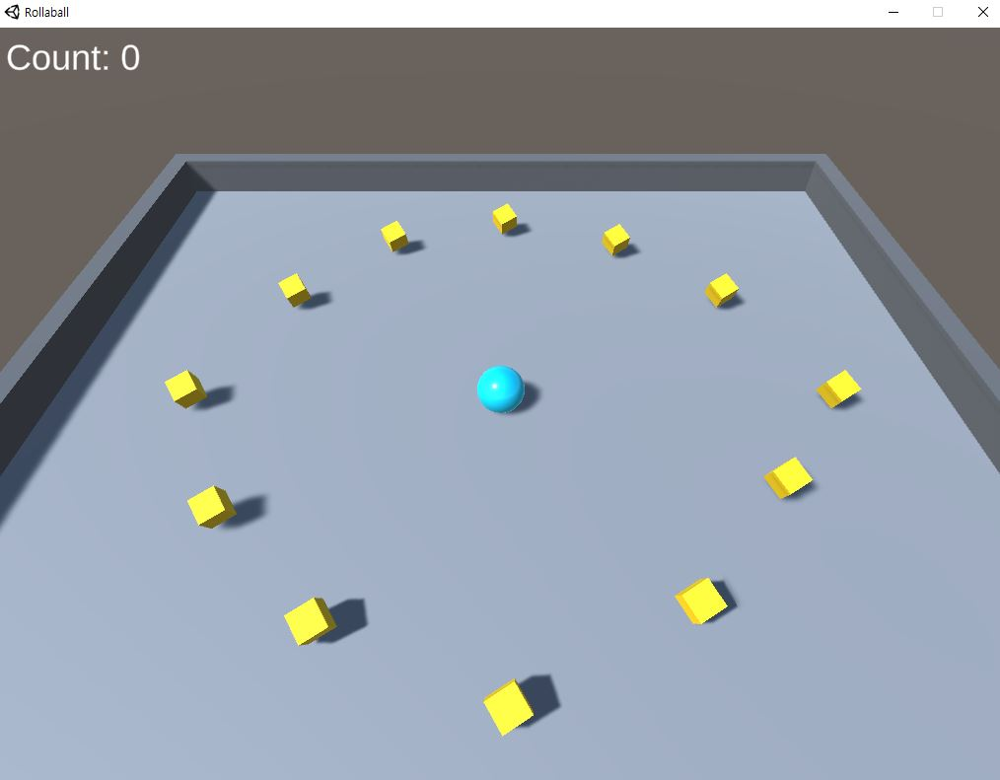
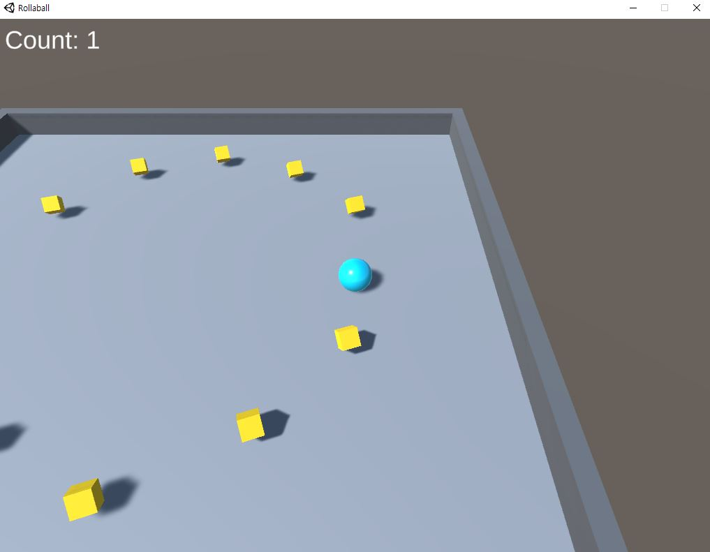
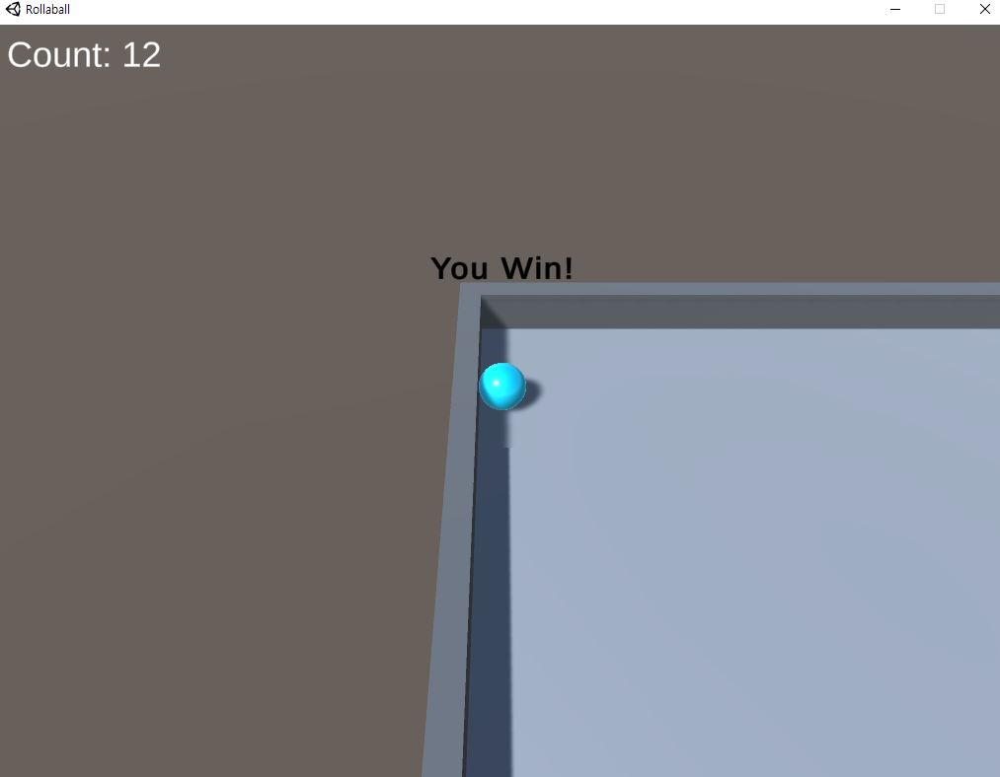

## 💌 Roll-a-Ball 이란?

[▶ Roll-a-Ball - Unity Learn 튜토리얼 링크](https://learn.unity.com/project/roll-a-ball-1?uv=2019.4)

Unity에서 공식적으로 제공하는 게임 튜토리얼 ‘**Roll-a-Ball**’을 제작하였다. Unity 설정부터, Asset, C# Script 등 전반적인 게임 제작 방법을 익힐 수 있다.

---

## 🤍 주요 C# Script

### 🧡 CameraController

게임 실행시, 표시되는 화면을 Camera가 비추어준다고 생각하면 된다. 여기서는 Player 역할을 하는 공(ball)을 3인칭으로 따라다니는 Camera 설정을 지정해주었다.

```csharp
using System.Collections;
using System.Collections.Generic;
using UnityEngine;

public class CameraController : MonoBehaviour
{
    public GameObject player;

    private Vector3 offset;

    // Start는 첫 프레임 업데이트 이전에 호출됩니다.
    void Start()
    {
        offset = transform.position - player.transform.position;
    }

    // Update는 프레임마다 한 번씩 호출됩니다.
    void LateUpdate()
    {
        transform.position = player.transform.position + offset;
    }
}
```

---

### 🧡 PlayerController

Player를 방향키로 움직이고, 움직이는 speed를 지정해주는 역할이다. 또한 노란색 오브젝트와 부딪히면 득점하는 로직을 구현하기 위한 코드, 점수를 카운트하는 코드도 포함되어 있다.

```csharp
using UnityEngine;

// Unity UI 및 Input System을 사용하는 데 필요한 네임스페이스를 포함합니다.
using UnityEngine.InputSystem;
using TMPro;

public class PlayerController : MonoBehaviour
{

	// 플레이어 속도 및 텍스트 UI 게임 오브젝트에 대한 public 변수를 만듭니다.
	public float speed;
	public TextMeshProUGUI countText;
	public GameObject winTextObject;

	private float movementX;
	private float movementY;

	private Rigidbody rb;
	private int count;

	// 게임을 시작할 때
	void Start()
	{
		// 리지드바디 컴포넌트를 private rb 변수에 할당합니다.
		rb = GetComponent<Rigidbody>();

		// count를 0으로 설정합니다. 
		count = 0;

		SetCountText();

		// Win Text UI의 텍스트 프로퍼티를 빈 문자열로 설정하여 'You Win'(게임 오버 메시지)을 공백으로 만듭니다.
		winTextObject.SetActive(false);
	}

	void FixedUpdate()
	{
		// Vector3 변수를 만들고 X와 Z를 할당하여 위의 horizontal 및 vertical 플로트 변수를 구현합니다.
		Vector3 movement = new Vector3(movementX, 0.0f, movementY);

		rb.AddForce(movement * speed);
	}

	void OnTriggerEnter(Collider other)
	{
		// 교차하는 게임 오브젝트에 'Pick Up' 태그가 할당되어 있는 경우
		if (other.gameObject.CompareTag("PickUp"))
		{
			other.gameObject.SetActive(false);

			// 점수 변수 'count'에 1을 추가합니다.
			count = count + 1;

			// 'SetCountText()' 함수를 실행합니다(아래 참조).
			SetCountText();
		}
	}

	void OnMove(InputValue value)
	{
		Vector2 v = value.Get<Vector2>();

		movementX = v.x;
		movementY = v.y;
	}

	void SetCountText()
	{
		countText.text = "Count: " + count.ToString();

		if (count >= 12)
		{
			// 'winText'의 텍스트 값을 설정합니다.
			winTextObject.SetActive(true);
		}
	}
}
```

---

### 🧡 Rotator

점수 역할을 하는 노란색 오브젝트의 애니메이션을 주는 역할이다. 이때 `Prefab`이라는 복제(컨트롤 타워) 기능을 이용해 여러개의 오브젝트를 한번에 조정할 수 있다.

```csharp
using UnityEngine;
using System.Collections;

public class Rotator : MonoBehaviour
{

	// 각 프레임을 렌더링하기 전에
	void Update()
	{
		// 이 스크립트가 연결된 게임 오브젝트를 X축으로 15도,
		// Y축으로 30도, Z축으로 45도 회전하고 deltaTime 값을 곱하면
		// 프레임이 아닌 초를 기준으로 회전합니다.
		transform.Rotate(new Vector3(15, 30, 45) * Time.deltaTime);
	}
}
```

---

## 🤍 개인적 생각

- 점수를 카운트하여 UI TEXT를 조작하는 부분은 새로운 Script와 Asset에게 할당해주는 것이 깔끔하다. Asset은 invisible하게 만들 수 있으므로, 적극적으로 사용하여 역할을 분담시키는 것이 효율적이다.
- 이번에 구현한 CameraController의 기능(3인칭으로 Player 따라다니기)은 정말 많이 쓰이므로 기억해두면 유용할 듯 하다.

---

## ❤ 실행 화면 및 깃허브 링크







[▶ 깃허브 링크](https://github.com/JuHuiHeo/Roll_A_Ball)

```toc

```